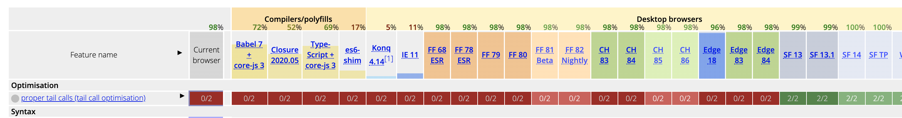
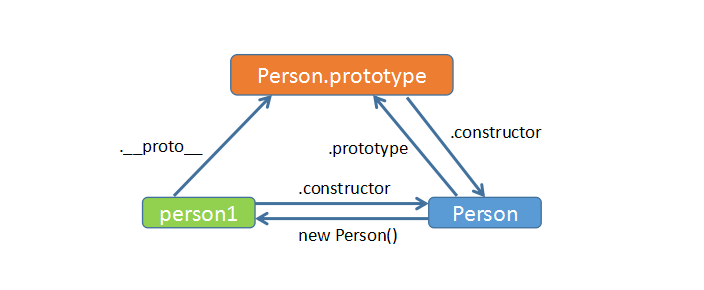
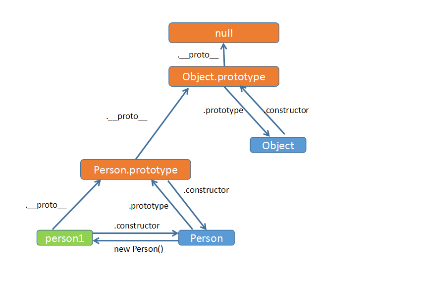
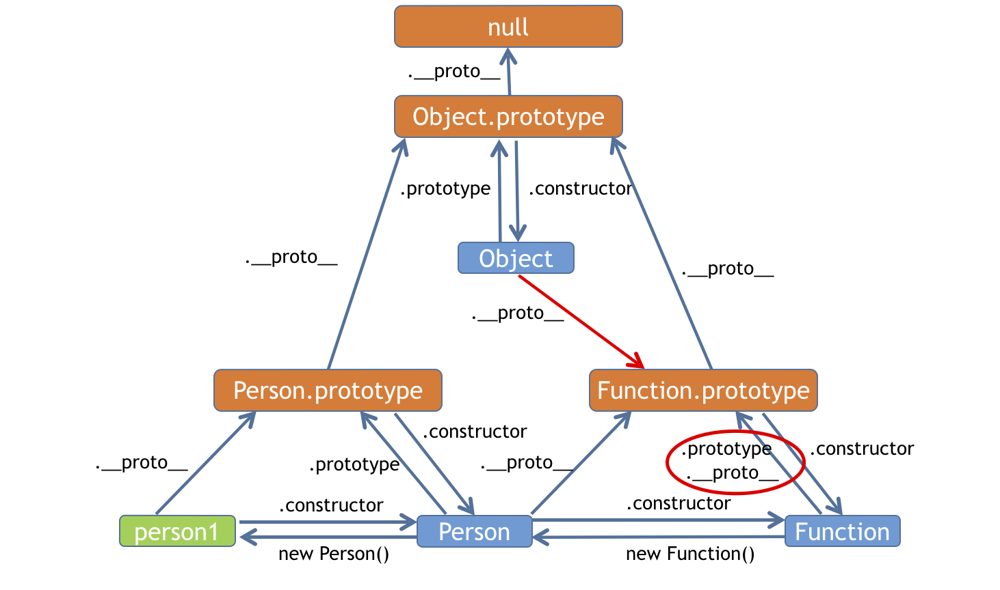

### 1、字符串如何不转义显示？

使用 `String.raw`，效果如下：

```js
String`asd`
// out: asd

String`\\asd`
// out: \asd

String.raw`\\asd`
// out: \\asd
```

`String.raw()` 是一个模板字符串的标签函数，它的作用类似于 Python 中的字符串前缀 r 和 C# 中的字符串前缀，用来获取一个模板字符串的原始字符串。

### 2、递归时如何避免栈溢出异常？

解决方案一：使用 **尾递归** 优化

例如：

```js
// 计算 0-N 的累加值（递归）
function f(n){
  if(n<=0){
    return 0;
  }
  return n + f(n-1)
}
```

可以改写成：

```js
// 计算 0-N 的累加值（尾递归）
function f(n,sum=0){
  if(n<=0){
    return sum;
  }
  return f(n-1,sum+n)
}
```

理论上，通过尾递归可以避免栈溢出异常，但是目前各大主流浏览器的[兼容性](http://kangax.github.io/compat-table/es6/)还不够，如图：



> V8引擎实际上已经实现了尾调用优化，但是默认是关闭该功能的

所以这个方法不具有通用性。

解决方案二：使用蹦床函数来避免栈溢出

蹦床函本质上是把递归函数包装在一个循环中。在内部，它逐条调用递归函数，直到它不再产生递归调用。

参考如下代码：

```js
// 定义蹦床函数
const trampoline = fn => (...args) => {
  let result = fn(...args)
  while (typeof result === 'function') {
    result = result()
  }
  return result
}

function f(n,sum=0){
  if(n<=0){
    return sum;
  }
  return ()=>f(n-1,sum+n)
}

const _f = trampoline(f)

_f(1000000)
// out: 500000500000
```

相关链接：

[Using trampolines to manage large recursive loops in JavaScript](https://blog.logrocket.com/using-trampolines-to-manage-large-recursive-loops-in-javascript-d8c9db095ae3/)

### 3、JS 有哪些作用域？

ES6 中有全局作用域、函数作用域与块级作用域。

let 实际上为 JavaScript 新增了块级作用域，例如：

```js
{
  for(var i =0;i<10;i++){

  }
}
console.log(i) // 10

{
  for(let i =0;i<10;i++){

  }
}
console.log(i) // Uncaught ReferenceError: i is not defined
```

### 4、JS 同源跨页面通信有哪些方法？

1、BroadCast Channel

[BroadCast Channel](https://developer.mozilla.org/en-US/docs/Web/API/BroadcastChannel) 可以帮我们创建一个用于广播的通信频道。当所有页面都监听同一频道的消息时，其中某一个页面通过它发送的消息就会被其他所有页面收到。它的API和用法都非常简单。

创建一个 `channel01` 的频道：

``` js
const myChannel = new BroadcastChannel('channel01');
```

各个页面可以通过onmessage来监听被广播的消息：

```js
bc.onmessage = function (e) {
  const data = e.data;
  console.log('[BroadcastChannel] receive message:', data);
};
```

要发送消息时只需要调用实例上的postMessage方法即可：

```js
bc.postMessage({msg:'hello world'});
```

2、LocalStorage

当 LocalStorage 变化时，会触发storage事件。利用这个特性，我们可以在发送消息时，把消息写入到某个 LocalStorage 中；然后在各个页面内，通过监听storage事件即可收到通知。

```js
// 注册onstorage事件
window.onstorage = (e) => {
  console.log(e);
};
```

```js
// 触发onstorage事件
window.localStorage.setItem('time', new Date().getTime());
```

3、window.postMessage

如果是 iframe 嵌套页面的通信，可以使用 `window.postMessage`

参考链接：[使用 postMessage 解决 iframe 跨域通信问题](https://juejin.cn/post/6844903477018116104)

4、其他方法

还可以通过 `Service Worker` 、 `Shared Worker` 、`IndexedDB` 实现页面间的通信。

相关链接：

[前端跨页面通信，你知道哪些方法？](https://segmentfault.com/a/1190000018731597)

### 5、聊一下 JS 的事件循环机制

如果有一些确定好的任务，可以使用一个单线程来按照顺序处理这些任务，这是第一版线程模型。


要在线程执行过程中接收并处理新的任务，就需要引入循环语句和事件系统，这是第二版线程模型。


如果要接收其他线程发送过来的任务，就需要引入消息队列，这是第三版线程模型。

如果其他进程想要发送任务给页面主线程，那么先通过 IPC 把任务发送给渲染进程的 IO 线程，IO 线程再把任务发送给页面主线程。


消息队列机制并不是太灵活，为了适应效率和实时性，引入了微任务。

[浏览器工作原理与实践](https://time.geekbang.org/column/article/132931)

[事件循环：微任务和宏任务](https://zh.javascript.info/event-loop)

### 6、谈谈宏任务和微任务

**每个宏任务之后，引擎会立即执行微任务队列中的所有任务，然后再执行其他的宏任务，或渲染，或进行其他任何操作**


具体来讲：

在一个事件循环中，异步事件返回结果后会被放到一个任务队列中。然而，根据这个异步事件的类型，这个事件实际上会被对应的宏任务队列或者微任务队列中去。并且在当前执行栈为空的时候，主线程会 查看微任务队列是否有事件存在。如果不存在，那么再去宏任务队列中取出一个事件并把对应的回到加入当前执行栈；如果存在，则会依次执行微任务队列中事件对应的回调，直到微任务队列为空。然后去宏任务队列中取出最前面的一个事件，把对应的回调加入当前执行栈…如此反复

[事件循环：微任务和宏任务](https://zh.javascript.info/event-loop)

[总结事件轮询机制，以及宏任务队列与微任务队列](https://www.cnblogs.com/jiangyuzhen/p/11064408.html)

### 7、列举几个产生宏任务、微任务的方式

#### 宏任务

- setTimeout
- setInterval
- requestAnimationFrame

#### 微任务

- MutationObserver
- Promise.then
- queueMicrotask

参考链接：

[事件循环：微任务和宏任务](https://zh.javascript.info/event-loop)

### 8、下面代码的执行结果是什么？

```js
Promise.resolve().
  then(() => console.log(1)).
  then(() => console.log(2)).
  then(() => console.log(3));

Promise.resolve().
  then(() => console.log(11)).
  then(() => console.log(22)).
  then(() => console.log(33));
```

执行结果是：

```bash
1
11
2
22
3
33
```

解释：上面的代码执行时会把 `console.log(1)` 和 `console.log(11)` 推入微任务队列，并在当前执行栈完成后开始执行微任务队列里的代码；执行完 `console.log(1)` 后发现有 `console.log(2)` 微任务，把它放入微任务队列中；然后执行 `console.log(11)` 后发现有 `console.log(22)` 微任务，继续放入微任务队列中。以此循环，直到微任务队列为空。

### 9、聊聊原型链

1、先来一串代码

```js
var Person = function(msg){
    this.msg = msg;
}
var person1 = new Person("wanger")

person1.constructor===Person;    //true
Person === Person.prototype.constructor; //true
person1.__proto__ === Person.prototype; //true
person1.__proto__.constructor === person1.constructor //true
```

看着有些晕，我们可以画张图：



其中：

- 蓝色的是构造函数
- 绿色的是构造函数实例出来的对象
- 橙色的是构造函数的prototype,也是构造函数实例出来的对象的原型（它其实也是一个对象）

这里特别要注意的是 `prototype` 与 `__proto__` 的区别，`prototype` 是函数才有的属性，而 `__proto__` 是每个对象都有的属性。( `__proto__` 不是一个规范属性，只是部分浏览器实现了此属性，对应的标准属性是 `[[Prototype]]` )。

刚刚看到的是原型，那原型链在哪儿呢？不要着急，我们可以向上追溯：



事实上，我们还可以画的更完整些：



参考链接：

[原型链](https://wangyulue.com/code/frontend/%E5%8E%9F%E5%9E%8B%E9%93%BE.html)
