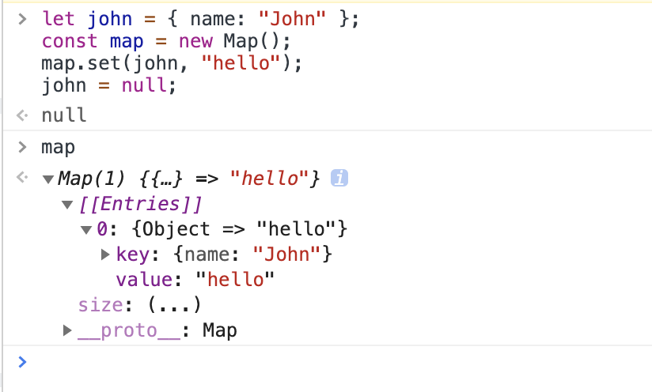

<!-- 数据类型的转换 相关问题 -->
### 1、考察 Number 方法

下面运算的结束是什么？为什么？

```js
Number({a: 1})
Number([1, 2, 3])
Number([5])
```

运算的结果是：

```js
NaN
NaN
5
```

`Number`背后的转换规则比较复杂。

1. 调用对象自身的`valueOf`方法。如果返回原始类型的值，则直接对该值使用`Number`函数，不再进行后续步骤。

2. 如果`valueOf`方法返回的还是对象，则改为调用对象自身的`toString`方法。如果`toString`方法返回原始类型的值，则对该值使用`Number`函数，不再进行后续步骤。

3. 如果`toString`方法返回的是对象，就报错。

查看下面这个例子：

```js
var obj = {x: 1};
Number(obj) // NaN

// 等同于
if (typeof obj.valueOf() === 'object') {
  Number(obj.toString());
} else {
  Number(obj.valueOf());
}
```

上面代码中，`Number`函数将`obj`对象转为数值。背后发生了一连串的操作，首先调用`obj.valueOf`方法, 结果返回对象本身；于是，继续调用`obj.toString`方法，这时返回字符串`[object Object]`，对这个字符串使用`Number`函数，得到`NaN`。

参考链接：
[网道：数据类型的转换](https://wangdoc.com/javascript/features/conversion.html#number)

### 2、考察 String 方法

下面运算的结束是什么？为什么？

```js
String({a: 1})
String([1, 2, 3])
```

运算的结果是：

```js
"[object Object]"
"1,2,3"
```

`String`方法背后的转换规则，与`Number`方法基本相同，只是互换了`valueOf`方法和`toString`方法的执行顺序。

1. 先调用对象自身的`toString`方法。如果返回原始类型的值，则对该值使用`String`函数，不再进行以下步骤。

2. 如果`toString`方法返回的是对象，再调用原对象的`valueOf`方法。如果`valueOf`方法返回原始类型的值，则对该值使用`String`函数，不再进行以下步骤。

3. 如果`valueOf`方法返回的是对象，就报错。

下面是一个例子。

```javascript
String({a: 1})
// "[object Object]"

// 等同于
String({a: 1}.toString())
// "[object Object]"
```

上面代码先调用对象的`toString`方法，发现返回的是字符串`[object Object]`，就不再调用`valueOf`方法了。

参考链接：
[网道：数据类型的转换](https://wangdoc.com/javascript/features/conversion.html#string)

### 3、对象隐式转换过程

JavaScript 尝试查找并调用下面对象中的方法：

1. 调用 obj[Symbol.toPrimitive] —— 带有 symbol 键 Symbol.toPrimitive（系统 symbol）的方法，如果这个方法存在的话，
1. 分情况（具体可以看上面两题）先后调用 `obj.toString()` 和 `obj.valueOf()`，无论哪个存在。

参考链接
[对象 — 原始值转换](https://zh.javascript.info/object-toprimitive)

### 4、WeakMap 与 Map 有什么不同？

1、第一个不同点：**Map 的键可以是对象，也可以是原始值；而 WeakMap 的键必须是对象**

```js
const weakMap = new WeakMap();

const obj = {};

weakMap.set(obj, "ok"); // 正常工作（以对象作为键）

// 不能使用字符串作为键
weakMap.set("test", "Whoops"); // Error，因为 "test" 不是一个对象
```

2、第二个不同点：**在 WeakMap 中使用一个对象作为键，并且没有其他对这个对象的引用 —— 该对象将会被从内存（和map）中自动清除。**

看实际例子：

```js
let john = { name: "John" };
const map = new Map();
map.set(john, "hello");
john = null;
```



可以看到 `{ name: "John" }` 对象没有被 GC 回收，因为 map 中还有对它的引用

```js
let john = { name: "John" };
const map = new WeakMap();
map.set(john, "hello");
john = null;
```


在 `WeakMap` 中，及时有引用也会被 GC 回收，而且 map 中的相应简直对会被自动删除。

参考链接：
[WeakMap and WeakSet](https://zh.javascript.info/weakmap-weakset)

### 5、举个例子谈谈 WeakMap 有什么应用场景？

例如，我们有用于处理用户访问计数的代码。收集到的信息被存储在 map 中：一个用户对象作为键，其访问次数为值。当一个用户离开时（该用户对象将被垃圾回收机制回收），这时我们就不再需要他的访问次数了。

下面是一个使用 Map 的计数函数的例子：

```js
// visitsCount.js
let visitsCountMap = new Map(); // map: user => visits count

// 递增用户来访次数
function countUser(user) {
  let count = visitsCountMap.get(user) || 0;
  visitsCountMap.set(user, count + 1);
}
```

下面是其他部分的代码，可能是使用它的其它代码：

```js
// main.js
let john = { name: "John" };

countUser(john); // count his visits

// 不久之后，john 离开了
john = null;
```

现在 john 这个对象应该被垃圾回收，但他仍在内存中，因为它是 visitsCountMap 中的一个键。

当我们移除用户时，我们需要清理 visitsCountMap，否则它将在内存中无限增大。在复杂的架构中，这种清理会成为一项繁重的任务。

我们可以通过使用 WeakMap 来避免这样的问题：

```js
// visitsCount.js
let visitsCountMap = new WeakMap(); // weakmap: user => visits count

// 递增用户来访次数
function countUser(user) {
  let count = visitsCountMap.get(user) || 0;
  visitsCountMap.set(user, count + 1);
}
```

现在我们不需要去清理 visitsCountMap 了。当 john 对象变成不可访问时，即便它是 WeakMap 里的一个键，它也会连同它作为 WeakMap 里的键所对应的信息一同被从内存中删除。

参考链接：
[WeakMap and WeakSet](https://zh.javascript.info/weakmap-weakset#shi-yong-an-li-ewai-de-shu-ju)

### 6、将 "defer()" 添加到函数的原型上

在所有函数的原型中添加 defer(ms) 方法，该方法返回一个包装器，将函数调用延迟 ms 毫秒。

使得下面的例子可以执行：

```js
function f(a, b) {
  alert( a + b );
}

f.defer(1000)(1, 2); // 1 秒后显示 3
```

解答：

```js
Function.prototype.defer = function (ms) {
  return (...args) => {
    setTimeout(() => this(...args), ms);
  }
};
```

参考链接：
[将装饰器 "defer()" 添加到函数](https://zh.javascript.info/task/defer-to-prototype-extended)

### 7、如何获得对象的类型？

一般可以通过 `typeof` 来获得对象的类型，例如：

```js
console.log(typeof null);         // 'object'
console.log(typeof undefined);    // 'undefined'
console.log(typeof 1);            // 'number'
console.log(typeof true);         // 'boolean'
console.log(typeof 'hello');      // 'string'
console.log(typeof {});           // 'object'
console.log(typeof []);           // 'object'
console.log(typeof new Date());   // 'object'
console.log(typeof new RegExp()); // 'object'
console.log(typeof Symbol());     // 'symbol'
console.log(typeof BigInt(1));    // 'bigint'
```

但是 `typeof` 有他的缺陷，无法知道 `Object`、`Array`、`Date`、`RegExp` 的具体类型，显示出来都是 `'object'`。

这时候可以借助 `Object.prototype.toString` 来解决这个问题，参考下面的例子：

```js
const getType = Object.prototype.toString;

console.log(getType.call(null));          // '[object Null]'
console.log(getType.call(undefined));     // '[object Undefined]'
console.log(getType.call(1));             // '[object Number]'
console.log(getType.call(true));          // '[object Boolean]'
console.log(getType.call('hello'));       // '[object String]'
console.log(getType.call({}));            // '[object Object]'
console.log(getType.call([]));            // '[object Array]'
console.log(getType.call(new Date()));    // '[object Date]'
console.log(getType.call(new RegExp()));  // '[object RegExp]'
console.log(getType.call(Symbol()));      // '[object Symbol]'
console.log(getType.call(BigInt(1)));     // '[object BigInt]'
```

参考链接：
[使用 Object.prototype.toString 方法来揭示类型](https://zh.javascript.info/instanceof#fu-li-shi-yong-objectprototypetostring-fang-fa-lai-jie-shi-lei-xing)
