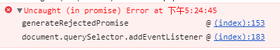

<!-- promise 相关 -->

### 1、在异常处理中，如果 try 中 return 了， finally 中的代码还会不会执行？

参考下面的例子：

```js
function func() {
  try {
    console.log('try code')
    return 1;
  } catch (e) {
    console.log('error code')
  } finally {
    console.log('finally code');
  }
}

func()
```

上面会打印：

```js
'try code'
'finally code'
```

因为 **finally 会在控制转向外部代码前被执行**。

### 2、Promise 中 resolve 或 reject 后，后面的代码还会运行吗？

参考下面的例子，会不会打印 `after resolve`?

```js
new Promise((res, rej) => {
  setTimeout(() => {
    res('ok');
    console.log('after resolve')
  })
}).then(res => {
  console.log('settled:', res);
})
```

答案是 **会** ，`Promise` 中 `resolve` 或 `reject` 后，后面的代码会继续运行。

### 3、Promise 中， finally 后面的 then 会不会运行？

参考下面的例子，打印结果是什么?

```js
new Promise((resolve, reject) => {
  setTimeout(() => resolve("result"), 2000)
})
  .finally(() => console.log("run finally"))
  .then(result => console.log(result));
```

finally 后的 then 可以继续运行，上面代码运行结果是：

```bash
run finally
result
```

`finally()` 方法返回一个 `Promise`。 在 `promise` 结束时，无论结果是 `fulfilled` 或者是 `rejected`，都会执行指定的回调函数。这为在 `Promise` 是否成功完成后都需要执行的代码提供了一种方式。

参考链接：

[MDN](https://developer.mozilla.org/zh-CN/docs/Web/JavaScript/Reference/Global_Objects/Promise/finally)

[Promise finally](https://zh.javascript.info/promise-basics#finally)

### 4、Promise：then 对比 catch

这两个代码片段是否相等？换句话说，对于任何处理程序，它们在任何情况下的行为都相同吗？

```js
promise.then(f1).catch(f2);

// 对比：

promise.then(f1, f2);
```

解答：

**不，它们不相等。**

不同之处在于，如果 `f1` 中出现 `error`，那么在这儿它会被 `.catch` 处理：

```js
promise
  .then(f1)
  .catch(f2);
```

……在这儿则不会：

```js
promise
  .then(f1, f2);
```

这是因为 `error` 是沿着链传递的，而在第二段代码中，`f1` 下面没有链。

换句话说，`.then` 将 `result/error` 传递给下一个 `.then/.catch`。所以在第一个例子中，在下面有一个 `catch`，而在第二个例子中并没有 `catch`，所以 `error` 未被处理。

参考链接：

[Promise：then 对比 catch](https://zh.javascript.info/task/then-vs-catch)

### 5、下面代码的运行结果是什么？

```js
new Promise((resolve, reject) => {
  resolve('success')
})
  .then(result => {
    console.log('1')
    throw 1;
  })
  .then(result => {
    console.log('2')
  })
  .catch(e => {
    console.log('12')
    throw 10;
  })
  .then(result => {
    console.log('3')
  })
  .then(result => {
    console.log('4')
  })
  .catch(e => {
    console.log('13')
  })
  .then(result => {
    console.log('5')
  })
  .then(result => {
    console.log('6')
  })
```

运行结果是：

```bash
1
12
13
5
6
```

通过上面的运行结果可以看出几点：

1、 Promise 周围有一个“隐式的 try..catch”。如果发生异常，异常不会被抛出，而是会被 rejection 捕获并被处理。

```js
new Promise((resolve, reject) => {
  throw new Error("Whoops!");
}).catch(console.log);

// 上面与下面的代码工作上完全相同

new Promise((resolve, reject) => {
  reject(new Error("Whoops!"));
}).catch(console.log);
```

2、`.then` 里出现异常后，接下来的 `.then` 都不会处理，直到遇到 `.catch`

3、`.catch` 被捕获到异常后，接下来的 `.then` 可以继续正常运行。

4、`.catch` 里也有可能会出现异常，这时候异常依然不会被直接抛出，而是看接下来会不会有另外的 `.catch` 来捕获到它

参考链接：
[使用 promise 进行错误处理](https://zh.javascript.info/promise-error-handling)

### 6、下面代码中，`.catch` 会被触发么？为什么？

代码如下：

```js
new Promise(function(resolve, reject) {
  setTimeout(() => {
    throw new Error("Whoops!");
  }, 1000);
}).catch(e=>{
  console.log(e)
});
```

答案是：**它不会被触发：**

上面讲过，函数代码周围有个“隐式的 try..catch”，但那是针对所有的同步错误的。

而这里的错误并不是同步的，而是在稍后生成的。因此，`promise` 无法处理它。

另外，即使是 `try..catch`，也无法捕获异步的异常，例如：

```js
try {
  setTimeout(() => {
    throw 1;
  })
} catch (e) {
  console.log('error', e);
}
```

上面 `setTimeout` 中的异常不会被捕获到。

参考链接：

[setTimeout 中的错误](https://zh.javascript.info/task/error-async)

### 7、下面代码的运行结果是什么？

```js
let a = 0;
const b = async () => {
  a = a + await 10;
  console.log('2', a);
  a = (await 10) + a;
  console.log('3', a);
}
b();
a++;
console.log('1', a);
```

运行结果是：

```bash
1 1
2 10
3 20
```

这里可能会有的疑惑是：为什么 `async` 里打印的是 10 和 20，而不是 11 和 21 ，明明a++ 执行在前，里面的函数执行在后；

这是因为：

- 首先函数 b 先执行，在执行到 await 10 之前变量 a 还是 0，因为在 await 内部实现了 generators ，generators 会保留堆栈中东西，所以这时候 a = 0 被保存了下来；
- 因为 await 是异步操作，所以会先执行 console.log('1', a)；
- 这时候同步代码执行完毕，开始执行异步代码，将保存下来的值拿出来使用，这时候 a = 10；
- 然后后面就是常规执行代码了；

以下写法执行可以符合预期：

```js
let a = 0
const b = async () => {
  let c = await 10;
  a = a + c;
  console.log('2', a);
  a = (await 10) + a;
  console.log('3', a);
}
b();
a++;
console.log('1', a);
```

### 8、如何捕获全局未处理的 Promise 异常？

可以使用 `unhandledrejection` 监听事件来捕获处理的 Promise 异常

```js
window.addEventListener('unhandledrejection', function(event) {
  // 这个事件对象有两个特殊的属性：
  console.log(event.promise); // [object Promise] - 生成该全局 error 的 promise
  console.log(event.reason); // Error: Whoops! - 未处理的 error 对象
});

new Promise(function() {
  throw new Error("Whoops!");
}); // 没有用来处理 error 的 catch
```

需要注意的是，上面的代码如果直接贴在浏览器开发者工具上，那么 `unhandledrejection` 听事件可能不会生效，详细可以参考下面的链接 [unhandledrejection not working in chrome](https://stackoverflow.com/questions/40026381/unhandledrejection-not-working-in-chrome)。

另外，即使异常被处理了，DevTools 依然会有错误信息：



如果需要禁用此错误信息，需要在 unhandledrejection 事件处理函数中调用：

```js
event.preventDefault();
```

参考链接：
[使用 promise 进行错误处理](https://zh.javascript.info/promise-error-handling)

[unhandledrejection not working in chrome](https://stackoverflow.com/questions/40026381/unhandledrejection-not-working-in-chrome)

[unhandledrejection 处理没有显式捕获的 Promise 异常](https://github.com/justjavac/the-front-end-knowledge-you-may-not-know/issues/7)

### 9、Generator 有没有了解过？谈谈它的一般用法

`Generator` 函数是 ES6 提供的一种异步编程解决方案，语法行为与传统函数完全不同。

形式上，`Generator` 函数是一个普通函数，但是有两个特征。一是，`function` 关键字与函数名之间有一个星号；二是，函数体内部使用 `yield` 表达式，定义不同的内部状态。

参考下面的代码：

```js
function* helloWorldGenerator() {
  yield 'hello';
  yield 'world';
  return 'ending';
}

const hw = helloWorldGenerator();

hw.next()
// { value: 'hello', done: false }

hw.next()
// { value: 'world', done: false }

hw.next()
// { value: 'ending', done: true }

hw.next()
// { value: undefined, done: true }
```

参考阅读：

[ECMAScript 6 入门](https://es6.ruanyifeng.com/#docs/generator)

### 10、Generator函数 和 async 函数 有什么关系？

async 函数可以看作 Generator 异步应用的语法糖。

举个例子说明问题，现在有个需求是：串形请求 3 个接口，最后再打印出来。

看看 `generator` 的写法：

```js
function* gen() {
  const r1 = yield fetch('https://api.github.com/users/github');
  const json1 = yield r1.json();
  const r2 = yield fetch('https://api.github.com/users/github/followers');
  const json2 = yield r2.json();
  const r3 = yield fetch('https://api.github.com/users/github/repos');
  const json3 = yield r3.json();

  console.log({ json1, json2, json3 });
}

function co(gen) {
  const g = gen();
  function _next(data) {
    const { done, value } = g.next(data);
    if (done) return;
    value.then(data => _next(data));
  }
  _next();
}

co(gen);
```

再看看 `async` 写法：

```js
async function gen() {
  const r1 = await fetch('https://api.github.com/users/github');
  const json1 = await r1.json();
  const r2 = await fetch('https://api.github.com/users/github/followers');
  const json2 = await r2.json();
  const r3 = await fetch('https://api.github.com/users/github/repos');
  const json3 = await r3.json();

  console.log({ json1, json2, json3 });
}

gen();
```

忽略第一个例子中的 `co` 辅助方法，可以看出 `generator` 和 `async` 写法几乎一样，无非是将 Generator 函数的星号（`*`）替换成 `async`，将 `yield` 替换成 `await`。

在谈谈刚刚忽略的 `co` 方法，它其实是著名程序员 TJ Holowaychuk 于 2013 年 6 月发布的一个小工具，用于 Generator 函数的自动执行。上面例子中的 `co` 方法只是简单实现，完整的 `co` 模块实现[点击这里](https://github.com/tj/co)查看。

参考阅读：

[ES6 系列之 Generator 的自动执行](https://github.com/mqyqingfeng/Blog/issues/99)

[ECMAScript 6 入门](https://es6.ruanyifeng.com/#docs/async)
