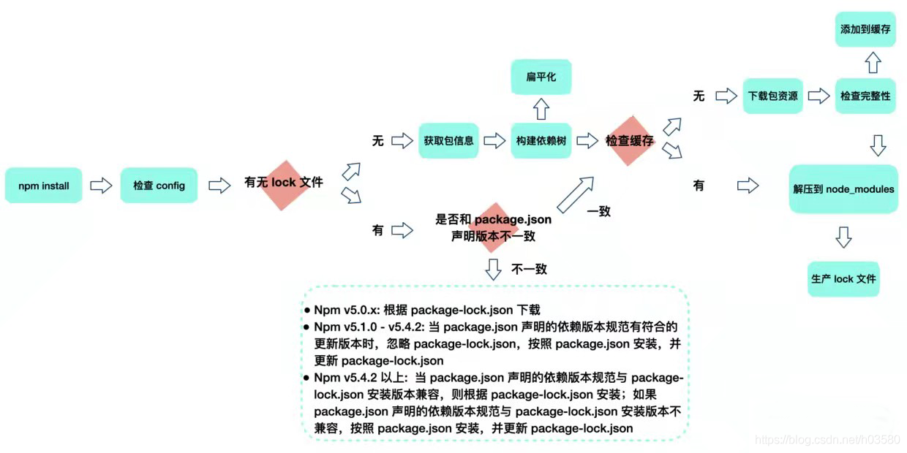

### 1、npx 有什么用？

1、调用项目安装的模块

比如，项目内部安装了测试工具 Mocha：

```bash
npm install -D mocha
```

那么以下两个命令都能执行 macha 命令

```bash
# 项目的根目录下执行
node-modules/.bin/mocha --version

npx mocha --version
```

2、避免全局安装模块

比如，`create-react-app` 这个模块是全局安装，npx 可以运行它，而且不进行全局安装：

```bash
npx create-react-app my-react-app
```

上面代码运行时，npx 将 `create-react-app` 下载到一个临时目录，使用以后再删除。所以，以后再次执行上面的命令，会重新下载 `create-react-app`。

#### npx 原理

npx 的原理，就是在运行它时，执行下列流程：

- 去 `node_modules/.bin` 路径检查 `npx` 后的命令是否存在，找到之后执行；
- 找不到，就去环境变量 `$PATH` 里面，检查 `npx` 后的命令是否存在，找到之后执行;
- 还是找不到，自动下载一个临时的依赖包最新版本在一个临时目录，然后再运行命令，运行完之后删除，不污染全局环境。

相关链接：
[npx 使用教程](https://www.ruanyifeng.com/blog/2019/02/npx.html)

### 2、package.json 版本依赖中，~ 和 ^ 的区别是什么？

`~` 会匹配最近的小版本依赖包，比如 `~1.2.3` 会匹配所有 1.2.x 版本，但是不包括 1.3.0；
`^` 会匹配最新的大版本依赖包，比如 `^1.2.3` 会匹配所有 1.x.x 的包，包括 1.3.0，但是不包括 2.0.0；

### 3、用 npm install 时发生了什么？

1. 检查 .npmrc 配置文件
1. 检查有无 package-lock.json 文件
1. 检查本地是否有缓存
1. 如果没有缓存，去相关源中下载（并同步到缓存中）



参考链接：

[掘金](https://juejin.cn/post/7016994983186006024)

### 4、谈谈 node_modules 的目录结构

#### (1)、嵌套结构

`npm` v3 之前的版本用的是嵌套结构，举个例子：

我们的模块 `my-app` 现在依赖了两个模块：`buffer`、`ignore`：

```json
{
  "name": "my-app",
  "dependencies": {
    "buffer": "^5.4.3",
    "ignore": "^5.1.4"
  }
}
```

`ignore` 是一个纯 JS 模块，不依赖任何其他模块，而 `buffer` 又依赖了下面两个模块：`base64-js` 、 `ieee754`。

```json
{
  "name": "buffer",
  "dependencies": {
    "base64-js": "^1.0.2",
    "ieee754": "^1.1.4"
  }
}
```

那么，执行 `npm install` 后，得到的 `node_modules` 中模块目录结构就是下面这样的：


嵌套结构的优点很明显：

1. `node_modules` 的结构和 `package.json` 结构一一对应，每次安装的目录结构都一致
1. 不会有版本冲突问题

但是坏处也显而易见：

1. 在不同层级的依赖中，可能引用了同一个模块，导致大量冗余
1. 嵌套可能非常深，在 `Windows` 系统中，文件路径最大长度为 260 个字符，嵌套过深可能导致不可预知的问题


为了解决上面的问题，`npm` 后来采用了扁平结构。

#### (2)、扁平结构

`npm` 在 `3.x` 版本做了一次较大更新。其将早期的嵌套结构改为扁平结构：

- 安装模块时，不管其是直接依赖还是子依赖的依赖，优先将其安装在 `node_modules` 根目录

还是上面的依赖结构，我们在执行 npm install 后将得到下面的目录结构：


此时我们若在模块中又依赖了 `base64-js@1.0.1` 版本：

```json
{
  "name": "my-app",
  "dependencies": {
    "buffer": "^5.4.3",
    "ignore": "^5.1.4",
    "base64-js": "1.0.1"
  }
}
```

- 当安装到相同模块时，判断已安装的模块版本是否符合新模块的版本范围，如果符合则跳过，不符合则在当前模块的 `node_modules` 下安装该模块。

此时，我们在执行 npm install 后将得到下面的目录结构：


对应的，如果我们在项目代码中引用了一个模块，模块查找流程如下：

- 在当前模块路径下搜索
- 在当前模块 node_modules 路径下搜素
- 在上级模块的 node_modules 路径下搜索
- ...
- 直到搜索到全局路径中的 node_modules

假设我们又依赖了一个包 `buffer2@^5.4.3`，而它依赖了包 `base64-js@1.0.3`，则此时的安装结构是下面这样的：


所以 `npm 3.x` 版本并未完全解决老版本的模块冗余问题，甚至还会带来新的问题。

试想一下，你的 APP 假设没有依赖 `base64-js@1.0.1` 版本，而你同时依赖了依赖不同 `base64-js` 版本的 `buffer` 和 `buffer2`。由于在执行 `npm install` 的时候，按照 `package.json` 里依赖的顺序依次解析，则 `buffer` 和 `buffer2` 在 `package.json` 的放置顺序则决定了 `node_modules` 的依赖结构。

参考链接：

[npm install 原理分析](https://cloud.tencent.com/developer/article/1555982)
