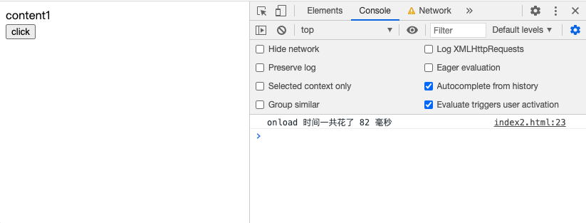
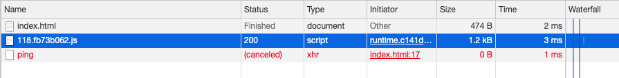
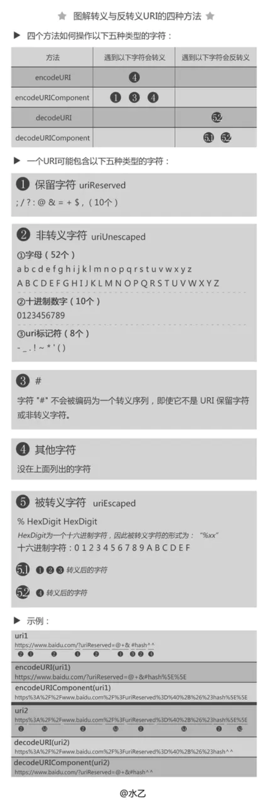
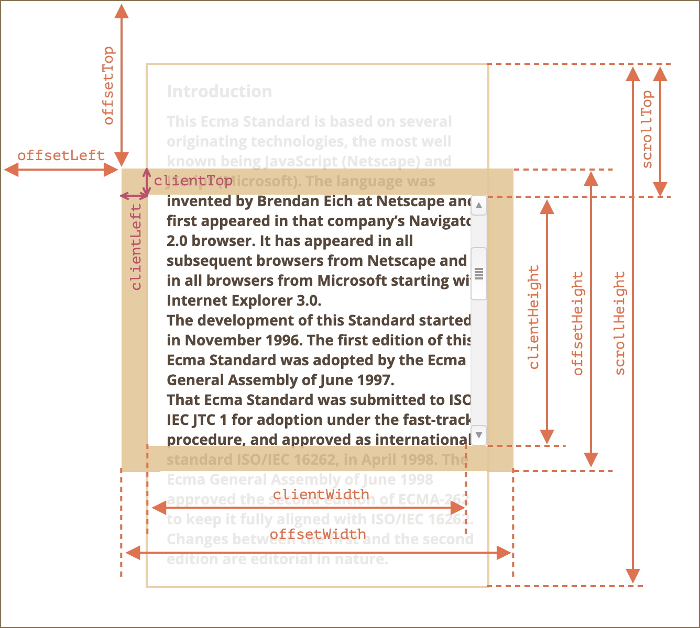

### 1、语义化标签的好处

- 样式丢失时能保持结构清晰
- 有利于 SEO
- 对屏幕阅读器友好

### 2、`<script>` 标签中 defer 和 async 的区别？

先通俗解释一下：

1、`<script src="script.js"></script>`

没有 defer 或 async，浏览器会立即加载并执行指定的脚本，“立即”指的是在渲染该 script 标签之下的文档元素之前，也就是说不等待后续载入的文档元素，读到就加载并执行。

2、`<script async src="script.js"></script>`

有 async，加载和渲染后续文档元素的过程将和 script.js 的加载与执行并行进行（异步）。

3、`<script defer src="script.js"></script>`

有 defer，加载后续文档元素的过程将和 script.js 的加载并行进行（异步），但是 script.js 的执行会在所有元素解析完成之后，DOMContentLoaded 事件触发之前完成。

再看一张图：


蓝色线代表网络读取，红色线代表执行时间，这俩都是针对脚本的；绿色线代表 HTML 解析。

所以有下面几个总结：

1. `defer` 和 `async` 在网络读取（下载）这块儿是一样的，都是异步的（相较于 HTML 解析）
1. 它俩的差别在于脚本下载完之后何时执行，显然 `defer` 是最接近我们对于应用脚本加载和执行的要求的
1. 关于 `defer`，此图未尽之处在于它是按照加载顺序执行脚本的，这一点要善加利用
1. `async` 则是一个乱序执行的主，反正对它来说脚本的加载和执行是紧紧挨着的，所以不管你声明的顺序如何，只要它加载完了就会立刻执行
1. 仔细想想，async 对于应用脚本的用处不大，因为它完全不考虑依赖（哪怕是最低级的顺序执行），不过它对于那些可以不依赖任何脚本或不被任何脚本依赖的脚本来说却是非常合适的，最典型的例子：Google Analytics

### 3、DOMContentLoaded 与 load 的区别?

**load**

load 应该仅用于检测一个完全加载的页面 当一个资源及其依赖资源已完成加载时，将触发load事件。

**DOMContentLoaded**

当初始的 HTML 文档被完全加载和解析完成之后，DOMContentLoaded 事件被触发 (html 所引用的内联 js、以及外链 js 的同步代码都执行完毕后触发)，而无需等待样式表、图像和子框架的完成加载。

### 4、如何减少重排重绘？

1. 对 DOM 属性的读写要分离
1. 动画 脱离文档流
1. 频繁的 DOM 操作使用节流或者去抖

### 5、Preload 和 Prefetch 是什么？

preload 是一种预加载的方式，它向浏览器声明一个需要提交加载的资源，浏览器自主决定什么时候加载这个资源。参考下面的例子：

```html
<!-- 使用 link 标签静态标记需要预加载的资源 -->
<link rel="preload" href="/path/to/a.css" as="style">
<link rel="preload" href="/path/to/b.js" as="script">
```

当资源真正被使用的时候就能立刻获取到，而无需网络请求再获取数据。

preload 与 prefetch 不同的地方就是 preload 专注于当前页面资源，并以高优先级加载资源，prefetch 专注于下一个页面将要加载的资源并以低优先级加载。

另外需要特别注意的是，**preload 和 prefetch 并不会阻塞 window 的 onload 事件**。

#### 再来举一个简单的例子

有这样的一个需求：页面上有两个content，content1 是首屏，需要加载后尽快显示出来；content2 是用户做一次点击操作后才显示出来，而且这个点击操作依赖第三方的资源。这个点击操作并不常见，一般几分钟后才可能被用户触发。那么，如何可以使 content1 尽快加载出来，但是有不影响用户的正常交互？

```html
<div id='content1'></div>
<div id='content2'></div>
<button id='button'>click</button>
<script>
  const startTime = Date.now();
  window.onload = () => {
    const endTime = Date.now();
    console.log(`onload 时间一共花了 ${endTime - startTime} 毫秒`);
    document.getElementById('content1').innerText = 'content1';
    document.getElementById('button').addEventListener('click', () => {
      if (window.jQuery) {
        jQuery('#content2').text('click onload')
      }
    })
  }
</script>
<script src='https://code.jquery.com/jquery-3.5.1.js'></script>
```

上面例子中，我们是加载了所有依赖的资源才显示首屏。这样会导致白屏时间较长，因为首屏不需要所有资源都被加载才显示。

在网络环境较差时测试，需要等待 4 秒才会显示首屏。


如何优化？可以使用 `Preload`:

```html
<link rel="preload" href="https://code.jquery.com/jquery-3.5.1.js" as="script">
<div id='content1'></div>
<div id='content2'></div>
<button id='button'>click</button>
<script>
  const startTime = Date.now();
  function insertScript(src) {
    const script = document.createElement('script');
    script.setAttribute('src', src);
    document.head.appendChild(script);
  }
  window.onload = () => {
    const endTime = Date.now();
    console.log(`onload 时间一共花了 ${endTime - startTime} 毫秒`);
    document.getElementById('content1').innerText = 'content1';
    insertScript('https://code.jquery.com/jquery-3.5.1.js');
    document.getElementById('button').addEventListener('click', () => {
      if (window.jQuery) {
        jQuery('#content2').text('click onload')
      }
    })
  }
</script>
```

可以看到首屏德时间瞬间减少到 83 毫秒：



为什么优化会这个明显？这是因为 preload 和 prefetch 不会阻塞 onload 事件，所以首屏可以飞速加载。一些非必要的资源文件可以用 preload 加载，用到的时候在真正引用，这样可以优化交互体验。

### 6、如何监控 DOM 变动？

可以使用 Mutation Observer API 用来监视 DOM 变动。DOM 的任何变动，比如节点的增减、属性的变动、文本内容的变动，这个 API 都可以得到通知。

例如下面的例子：

```html
<body>
  <div id='app'></div>
</body>
<script>
  const observer = new MutationObserver(function (mutations, observer) {
    mutations.forEach(function (mutation) {
      console.log(mutation);
    });
  });

  const app = document.getElementById('app');

  observer.observe(app, {
    'childList': true,
    'attributes': true
  });

  // test code
  app.append('Hello World');
</script>
```

参考阅读：
[网道](https://wangdoc.com/javascript/dom/mutationobserver.html)

[DOM 变动观察器（Mutation observer）](https://zh.javascript.info/mutation-observer)

### 7、页面在关闭之前需要发送一个请求给服务端，应该怎么做？

#### （1）、可以使用 `onbeforeunload` 全局钩子

例如：

```js
window.onbeforeunload = e => {
  fetch('http://backend.com/log', { method: 'post' })
};
```

#### （2）、也可以使用 `onunload` 全局钩子

例如：

```js
window.onunload = e => {
  fetch('http://backend.com/log', { method: 'post' })
};
```

但是上面的写法有问题，在 `onunload` 发出 ajax 请求会被浏览器取消，后端服务根本不会收到这个请求。可能是因为 ajax 请求是异步的，浏览器发现当前的页面已经被卸载了，就取消了还未发出的请求。



所以可以在 fetch 请求中加上 `keepalive`;

```js
window.onunload = e => {
  fetch('http://backend.com/log', { method: 'post', keepalive: true })
};
```

`keepalive`` 选项表示该请求可能会在网页关闭后继续存在 (参考自[javascript info](https://zh.javascript.info/fetch-api#keepalive))。

另外，浏览器为我们提供了别的 API：**Navigator.sendBeacon** ，Navigator.sendBeacon 方法用于向服务器异步发送数据。及时页面被关闭，浏览器也不会取消它的请求，所以上面代码改造如下：

```js
window.onunload = e => {
  navigator.sendBeacon('http://backend.com/log')
};
```

用 `sendBeacon` 发生请求有一些要求，如下：

- 请求以 POST 方式发送。
- 数据大小限制在 64kb。

参考链接：
[页面生命周期](https://zh.javascript.info/onload-ondomcontentloaded#windowonunload)

[网道](https://wangdoc.com/javascript/bom/xmlhttprequest.html#navigatorsendbeacon)

[MDN Beacon](https://developer.mozilla.org/zh-CN/docs/Web/API/Beacon_API/Using_the_Beacon_API)

### 8、`encodeURI` 和 `encodeURIComponent` 有什么区别？



参考链接：

[一张图看懂encodeURI、encodeURIComponent、decodeURI、decodeURIComponent的区别](https://juejin.cn/post/6844903454599544839)

### 9、简述一下 DOM 元素上常用的宽高度，例如：`clientWith`、`offsetHeight`



参考链接：

[元素大小和滚动](https://zh.javascript.info/size-and-scroll)

### 10、如何阻止浏览器的默认行为？

许多事件会自动触发浏览器执行某些行为。

例如：

- 点击一个链接 —— 触发导航（navigation）到该 URL。
- 点击表单的提交按钮 —— 触发提交到服务器的行为。

如何阻止它们？

有两种方式来告诉浏览器我们不希望它执行默认行为：

- 主流的方式是使用 `event`对象。有一个 `event.preventDefault()` 方法。
- 如果处理程序是使用 `on<event>`（而不是 `addEventListener`）分配的，那返回 `false` 也同样有效。

参考下面的例子：

```html
<a href="http://www.github.com" onclick="return false">button1</a>
<br>
<a href="http://www.github.com" onclick="event.preventDefault()">button2</a>
<br>
<a href="http://www.github.com" id='button3'>button3</a>
<br>
<a href="http://www.github.com" id='button4'>button4</a>
<script>
  document.getElementById('button3').addEventListener('click', event => {
    event.preventDefault();
  })
  document.getElementById('button4').addEventListener('click', event => {
    return false;
  })
</script>
```

上面例子中，点击 `button1`、`button2`、`button3` 会阻止默认行为，点击 `button4` 不会阻止默认行为。

参考链接：

[阻止浏览器行为](https://zh.javascript.info/default-browser-action#zu-zhi-liu-lan-qi-hang-wei)
