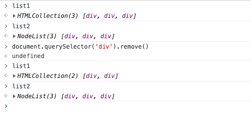
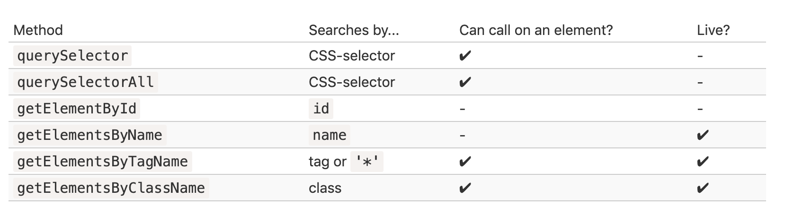

### 1、如何在网页中预览 PDF 文件？

可以使用 `object` 标签：

```html
<object type="application/pdf"
  data="/media/examples/demo.pdf"
  width="500"
  height="800">
</object>
```

参考阅读：
[网道 HTML教程](https://wangdoc.com/html/multimedia.html#object%EF%BC%8Cparam)

### 2、如何获得网页中的全部链接？

```js
document.links
```

### 3、一个视频窗口，希望它完全进入视口的时候自动播放，离开视口的时候自动暂停，应该怎么做？

传统的实现方法是，监听到`scroll`事件后，调用视频元素的[`getBoundingClientRect()`](https://developer.mozilla.org/en/docs/Web/API/Element/getBoundingClientRect)方法，得到它对应于视口左上角的坐标，再判断是否在视口之内。这种方法的缺点是，由于`scroll`事件密集发生，计算量很大，容易造成[性能问题](http://www.ruanyifeng.com/blog/2015/09/web-page-performance-in-depth.html)。

`IntersectionObserver` API 可以解决这个问题：

```html
<video src="foo.mp4" controls=""></video>
<script>
let video = document.querySelector('video');
let isPaused = false;

let observer = new IntersectionObserver((entries, observer) => {
  entries.forEach(entry => {
    if (entry.intersectionRatio != 1  && !video.paused) {
      video.pause();
      isPaused = true;
    } else if (isPaused) {
      video.play();
      isPaused=false;
    }
  });
}, {threshold: 1});

observer.observe(video);
</script>
```

上面代码中，`IntersectionObserver()`的第二个参数是配置对象，它的`threshold`属性等于`1`，即目标元素完全可见时触发回调函数。

参考文章：
[网道](https://wangdoc.com/webapi/intersectionObserver.html)

### 4、浏览器 Tab 页切换如何监听？

可以通过 `visibilitychange` 事件来监听页面的变化，然后通过 `document.visibilityState` 来得到当前页面的状态。

参考下面这个例子：

```js
document.addEventListener('visibilitychange', function () {
  // 用户离开了当前页面
  if (document.visibilityState === 'hidden') {
    document.title = '页面不可见';
  }
  // 用户打开或回到页面
  if (document.visibilityState === 'visible') {
    document.title = '页面可见';
  }
});
```

参考文章：
[网道](https://wangdoc.com/webapi/page-visibility.html#visibilitychange-%E4%BA%8B%E4%BB%B6)

### 5、document.getElementsByTagName('div') 与 document.querySelectorAll('div') 有什么区别？

`document.getElementsByTagName` 返回的是 `HTMLCollection` 类型的实例；`document.querySelectorAll` 返回的是 `NodeList` 类型的实例。需要注意的是， **`HTMLCollection` 实例都是动态集合，节点的变化会实时反映在集合中**。

做的再具体一些，他们最大的区别是 `getElementsByTagName` 方法都会返回一个 实时的（live） 集合，这样的集合始终反映的是文档的当前状态，并且在文档发生更改时会“自动更新”。

相反，`querySelectorAll` 返回的是一个 静态的 集合，就像元素的固定数组。

参考下面的例子：

```html
<div>1</div>
<div>2</div>
<div>3</div>
<script>
  const list1 = document.getElementsByTagName('div');
  const list2 = document.querySelectorAll('div');
</script>
```



删除一个 div 后， `list1` 也会动态变化。

事实上，**所有的 "getElementsBy*" 方法都会返回一个 实时的（live） 集合**。

参考下面的图片：



参考文章：
[NodeList 接口，HTMLCollection 接口](https://wangdoc.com/javascript/dom/nodelist.html)

[搜索：getElement*，querySelector*](https://zh.javascript.info/searching-elements-dom)
