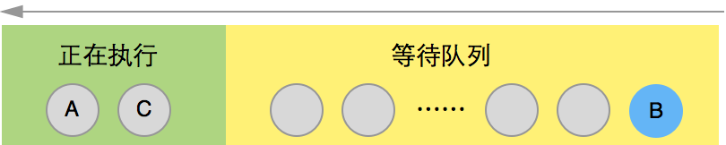

### 1、node 有哪些全局对象？

- process
- \_\_filename
- \_\_dirname
- console
- setInterval
- setTimeout

### 2、node 如何监听文件变化？

#### 使用 fs.watchfile

使用 fs 内置函数 watchfile 似乎可以解决问题：

```js
fs.watchFile(dir, (curr, prev) => {});
```

但这个回调执行有一定延迟，因为 `watchfile` 是通过 **轮询** 检测文件变化的，它并不能实时作出反馈，而且只能监听一个文件，存在效率问题。

#### 使用 fs.watch

使用 fs 的另一个内置函数 watch 是更好的选择：

```js
fs.watch(dir, (event, filename) => {});
```

`watch` 通过操作系统提供的文件更改通知机制，在 Linux 操作系统使用 inotify，在 macOS 系统使用 FSEvents,在 windows 系统使用 ReadDirectoryChangesW，而且可以用来监听目录的变化，在监听文件夹的场景中，比创建 N 个 `fs.watchfile` 效率高出很多。

但是 `fs.watch` 的问题是，由于不同系统文件通知的不一致性，`fs.watch`有时候会带来多次触发，这时候需要通过 对比文件修改时间、md5 对比文件、防抖等做额外的优化。

#### 使用第三方库 chokidar

`chokidar` 是 node 文件监听优秀的第三方解决方案，它解决了上述 `fs.watchfile` 和 `fs.watch` 带来的问题。目前在 `VS Code`, `PM2`, `webpack` 等知名框架中广泛使用。

使用方式如下：

```js
const chokidar = require("chokidar");

chokidar.watch("./src").on("all", (event, path) => {
  console.log(event, path);
});
```

参考链接：

[精读《如何利用 Nodejs 监听文件夹》](https://segmentfault.com/a/1190000015159683)

[NPM: chokidar](https://www.npmjs.com/package/chokidar)

### 3、Process.nextTick 和 setImmediate 的区别？

```js
A();
process.nextTick(B);
C();
```


```js
A();
setImmediate(B);
C();
```



他们的语义和实际作用是反过来的。

参考链接：

[Process.nextTick 和 setImmediate 的区别？](https://www.zhihu.com/question/23028843)

[Node docs: Node.js 事件循环，定时器和 process.nextTick()](https://nodejs.org/zh-cn/docs/guides/event-loop-timers-and-nexttick/#process-nexttick-setimmediate)

### 4、setTimeout 和 setImmediate 的区别？

`setImmediate()` 和 `setTimeout()` 很类似，但是基于被调用的时机，他们也有不同表现。

- `setImmediate()` 设计为一旦在当前 **轮询** 阶段完成，就执行脚本。
- `setTimeout()` 在最小阈值（ms 单位）过后运行脚本。

执行计时器的顺序将根据调用它们的上下文而异。如果二者都从主模块内调用，则计时器将受进程性能的约束（这可能会受到计算机上其他正在运行应用程序的影响）。

例如，如果运行以下不在 I/O 周期（即主模块）内的脚本，则执行两个计时器的顺序是非确定性的，因为它受进程性能的约束：

```js
// timeout_vs_immediate.js
setTimeout(() => {
  console.log("timeout");
}, 0);

setImmediate(() => {
  console.log("immediate");
});
```

```bash
$ node timeout_vs_immediate.js
timeout
immediate

$ node timeout_vs_immediate.js
immediate
timeout
```

但是，如果你把这两个函数放入一个 I/O 循环内调用，setImmediate 总是被优先调用：

```js
// timeout_vs_immediate.js
const fs = require("fs");

fs.readFile(__filename, () => {
  setTimeout(() => {
    console.log("timeout");
  }, 0);
  setImmediate(() => {
    console.log("immediate");
  });
});
```

```bash
$ node timeout_vs_immediate.js
immediate
timeout

$ node timeout_vs_immediate.js
immediate
timeout
```

使用 `setImmediate()` 相对于 `setTimeout()` 的主要优势是，如果 `setImmediate()` 是在 I/O 周期内被调度的，那它将会在其中任何的定时器之前执行，跟这里存在多少个定时器无关

参考链接：

[Node docs: Node.js 事件循环，定时器和 process.nextTick()](https://nodejs.org/zh-cn/docs/guides/event-loop-timers-and-nexttick/#process-nexttick-setimmediate)

### 5、node 有哪些方式开启多线程？

- child processes
- cluster
- worker threads

参考链接：

[Single thread vs child process vs worker threads vs cluster in nodejs](https://alvinlal.netlify.app/blog/single-thread-vs-child-process-vs-worker-threads-vs-cluster-in-nodejs)

[Node.js 多线程完全指南](https://segmentfault.com/a/1190000018660861)

[nodejs 中的子进程，深入解析 child_process 模块和 cluster 模块](https://segmentfault.com/a/1190000016169207)
