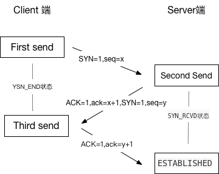
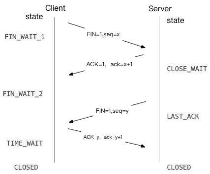

### 1、TCP/IP 模型有几层？它们分别解决了什么问题

- 物理层：网线传输比特流
- 数据链路层：解决了局域网内主机间通信
- 网络层：解决了两个局域网之间的通信
- 传输层：解决了数据传输到主机后，应该交给哪个进程处理的问题w

### 2、HTTP 有哪些常见的状态码

1、`200 OK`: 请求成功

2、`301 Moved Permanently`: 永久重定向

3、`302 Found`: 临时重定向

4、`304 Not Modified`: 所请求的资源未修改

5、`400 Bad Request`: 客户端请求的语法错误，服务器无法理解

6、`401 Unauthorized`: 请求要求用户的身份认证

7、`403 Forbidden`: 服务器拒绝执行此请求

8、`404 Not Found`: 要请求的资源没有找到

9、`500 Internal Server Error`: 服务器内部错误

相关链接：
[HTTP 响应代码](https://developer.mozilla.org/zh-CN/docs/Web/HTTP/Status)

### 3、为什么服务器有时候会返回 304 状态码

先上一张HTTP请求流程图：


浏览器进行资源请求时，大致会经过如下几个阶段：

#### 1、是否禁止缓存

**禁止缓存**指的是缓存中不得存储任何关于客户端请求和服务端响应的内容。每次由客户端发起的请求都会下载完整的响应内容。

在请求头中，`Cache-Control: no-store`与`Pragma: no-cache`都可以禁止缓存，

但两者也有区别，`Pragma: no-cache`可以兼容`http 1.0` ，而`Cache-Control: no-store`是`http 1.1`提供的。因此，`Pragma: no-cache`可以应用到`http 1.0`和`http 1.1`,而`Cache-Control: no-store`只能应用于`http 1.1`。

#### 2、是否检查本地副本是否过期

**是否检查本地版本是否过期**主要由`Cache-Control` 的 `no-cache`和`must-revalidate`这两个可选值控制，其中：

>* `no-cache`: 告诉浏览器、缓存服务器，不管本地副本是否过期，使用资源副本前，一定要到源服务器进行副本有效性校验。
>* `must-revalidate`：告诉浏览器、缓存服务器，本地副本过期前，可以使用本地副本；本地副本一旦过期，必须去源服务器进行有效性校验。

#### 3、本地副本是否过期

想要知道本地副本是否过期，我们就需要了解**缓存的过期机制**：

(1)、过期机制中，最重要的指令是 `max-age=<seconds>`,它表示资源能够被缓的最大时间；它通常会和`must-revalidate`一起使用，使用起来就像下面这样：

```js
Cache-Control: max-age=60, must-revalidate
```

(2)、如果不含有`max-age`属性，则会去查看是否包含[Expires](https://developer.mozilla.org/zh-CN/docs/Web/HTTP/Headers/Expires)属性，，通过比较[Expires](https://developer.mozilla.org/zh-CN/docs/Web/HTTP/Headers/Expires)的值和头里面[Date](https://developer.mozilla.org/zh-CN/docs/Web/HTTP/Headers/Date)属性的值来判断是否缓存还有效。


(3)、如果 `max-age` 和 `expires` 属性都没有，找找头里的 [Last-Modified](https://developer.mozilla.org/zh-CN/docs/Web/HTTP/Headers/Last-Modified) 信息。如果有，缓存的寿命就等于头里面 `Date`的值减去`Last-Modified`的值除以10（注：根据rfc2626其实也就是乘以10%）。


#### 4、如果本地副本没有过期

如果本地副本没有过期，则会直接重缓存中读取资源，并返回200状态码。


#### 5、如果本地副本过期

如果本地副本过期，则会进行**到源服务器进行有效性校验的前期准备**。

首先，会在请求头里寻找[If-None-Match](https://developer.mozilla.org/zh-CN/docs/Web/HTTP/Headers/If-None-Match)字段，其值为服务器上次返回的[ETag](https://developer.mozilla.org/zh-CN/docs/Web/HTTP/Headers/ETag)响应头的值:


如果请求头里没有[If-None-Match](https://developer.mozilla.org/zh-CN/docs/Web/HTTP/Headers/If-None-Match)字段，则会在请求头中寻找[If-Modified-Since](https://developer.mozilla.org/zh-CN/docs/Web/HTTP/Headers/If-Modified-Since)字段，其值为服务器上次返回的[Last-Modified](https://developer.mozilla.org/zh-CN/docs/Web/HTTP/Headers/Last-Modified)响应头中的日期值：


如果`If-None-Match`与`If-Modified-Since`都没有，则会直接向服务器请求数据。

#### 6、到源服务器进行有效性校验

如果请求头中带有`If-None-Match`或`If-Modified-Since`，则会到源服务器进行有效性校验，**如果源服务器资源没有变化，则会返回304；如果有变化，则返回200；**

相关链接：
[304状态码](https://wangyulue.com/code/frontend/304%E7%8A%B6%E6%80%81%E7%A0%81.html)

### 4、HTTP 有哪些常见请求头和响应头

#### 常用的HTTP请求头

1、`Accept`: 表示可接受的响应内容类型

例如：`Accept: text/html,application/xhtml+xml,application/xml`

2、`Accept-Encoding`: 表示可接受的响应内容的编码方式

例如：`Accept-Encoding: gzip, deflate`

3、`Accept-Language`: 表示可接受的响应内容语言

例如：`Accept-Language: zh-CN`

4、`Authorization`: 表示请求资源时提供的认证信息，这个在 JWT 请求中经常会看到

例如：`Authorization: Bearer eykp***XVCJ9.eyJleH***dCI6MTU.v6XJh***rtqKq6L4`

5、`Cache-Control`: 用来指定当前的请求/回复中的，是否使用缓存机制

通常有 `no-cache` 、`no-store`、`max-age=<seconds>` 作为 value

例如：`Cache-Control: no-cache`

6、`Connection`: 表示浏览器想要的使用的连接类型

例如：`Connection: keep-alive`

7、`Host`: 表示要请求的服务器的域名以及端口号

例如：`Host: backend.com:8866`

8、`User-Agent`: 表示浏览器的身份标识

例如：`User-Agent: Mozilla/5.0 ***** Chrome/85.0.4183.83`

9、`Origin`: 表示请求该资源的域名或者IP

通常跨域请求资源时会看到这个请求头

例如：`Origin: http://47.98.63.26`

#### 常用的HTTP响应头

1、`Access-Control-Allow-Origin`: 指定哪些网站可以跨域源资源共享

例如：`Access-Control-Allow-Origin: *`

2、`Cache-Control`: 告诉浏览器缓存这个对象及缓存有效时间

例如：`Cache-Control: max-age=3600`

3、`Date`: 表示此条消息被发送时的日期和时间

例如：`Date: Tue, 15 Nov 1994 08:12:31 GMT`

4、`Last-Modified`: 表示所请求的对象的最后修改日期

例如：`Last-Modified: Dec, 26 Dec 2015 17:30:00 GMT`

5、`ETag`: 表示对于某个资源的某个特定版本的一个标识符

通常用于检查资源是否过期

例如：`ETag: "737060cd8c284d8af7ad3082f209582d"`

6、`Expires`: 指定一个日期/时间，超过该时间则认为此回应已经过期

例如：`Expires: Thu, 01 Dec 1994 16:00:00 GMT`

相关链接：
[常用的HTTP请求头与响应头](https://itbilu.com/other/relate/EJ3fKUwUx.html)

### 5、HTTP 中 Get 和 Post 的区别？

**GET 和 POST 方法没有实质区别，只是报文格式不同。**

#### 相同点

GET 和 POST 只是 HTTP 协议中两种请求方式，而 HTTP 协议是基于 TCP/IP 的应用层协议，无论 GET 还是 POST，用的都是同一个传输层协议，所以在传输层上，没有区别。

#### 不同点

从 HTTP 定义的标准来看

- GET 用于信息获取，而且应该是安全和幂等的
- POST 请求表示可能修改服务器上资源的请求

从请求方式上来看

- GET 请求的数据会附在 URL后面，POST 的数据放在 HTTP 包体中
- POST 安全性比 GET 安全性高
- GET 请求是幂等性的，POST请求不是

### 6、TCP 三次握手



第一次：客户端发送连接请求报文给服务端，其中 SYN=1，seq=x。发送完毕后进入 YSN_END 状态。

第二次：服务端接收到报文后，发回确认报文，其中 ACK=1，ack=x+1，因为需要客户端确认，所以报文中也有 SYN=1，seq=y 的信息。发送完后进入 SYN_RCVD 状态。

第三次:客户端接收到报文后,发送确认报文，其中 ACK=1，ack=y+1。发送完客户端进入ESTABLISHED状态，服务端接收到报文后，进入 ESTABLISHED 状态。到此，连接建立完成。

相关链接：
[UDP和TCP协议](https://github.com/Android-XXM/XXM-BLOG/issues/16)

### 7、TCP 为什么需要三次握手？两次握手不行吗？

为了防止 **已失效的链接请求报文突然又传送到了服务端**，因而产生错误。

假设有这样一种场景，客户端发送了第一个请求连接并且没有丢失，而是在网络结点中滞留的时间太长了，由于TCP的客户端迟迟没有收到确认报文，以为服务器没有收到，此时重新向服务器发送这条报文，此后客户端和服务器经过两次握手完成连接，传输数据，然后关闭连接。此时此前滞留的那一次请求连接，网络通畅了到达了服务器，这个报文本该是失效的，但是，两次握手的机制将会让客户端和服务器再次建立连接，这将导致不必要的错误和资源的浪费。

如果采用的是三次握手，就算是那一次失效的报文传送过来了，服务端接受到了那条失效报文并且回复了确认报文，但是客户端不会再次发出确认。由于服务器收不到确认，就知道客户端并没有请求连接。

### 8、TCP 四次挥手



第一次挥手：客户端发送FIN=1，seq=x的包给服务端，表示自己没有数据要进行传输，单面连接传输要关闭。发送完后，客户端进入FIN_WAIT_1状态。

第二次挥手：服务端收到请求包后，发回ACK=1,ack=x+1的确认包，表示确认断开连接。服务端进入CLOSE_WAIT状态。客户端收到该包后，进入FIN_WAIT_2状态。此时客户端到服务端的数据连接已断开。

第三次挥手：服务端发送FIN=1,seq=y的包给客户端，表示自己没有数据要给客户端了。发送完后进入LAST_ACK状态，等待客户端的确认包。

第四次挥手：客户端收到请求包后，发送ACK=1,ack=y+1的确认包给服务端，并进入TIME_WAIT状态，有可能要重传确认包。服务端收到确认包后，进入CLOSED状态，服务端到客户端的连接已断开。客户端等到一段时间后也会进入CLOSED状态。

相关链接：
[UDP和TCP协议](https://github.com/Android-XXM/XXM-BLOG/issues/16)

### 9、为什么建立连接是三次握手，关闭连接确是四次挥手呢？

建立连接的时候，服务器在LISTEN状态下，收到建立连接请求的SYN报文后，把ACK和SYN放在一个报文里发送给客户端。

而关闭连接时，服务器收到对方的FIN报文时，仅仅表示对方不再发送数据了但是还能接收数据，而自己也未必全部数据都发送给对方了，所以己方可以立即关闭，也可以发送一些数据给对方后，再发送FIN报文给对方来表示同意现在关闭连接，因此，己方ACK和FIN一般都会分开发送，从而导致多了一次。

### 10、TCP如何保证可靠传输？

- 数据包校验
- 超时重传机制
- 对失序数据包重排序
- TCP供流量控制
- TCP供拥塞控制
