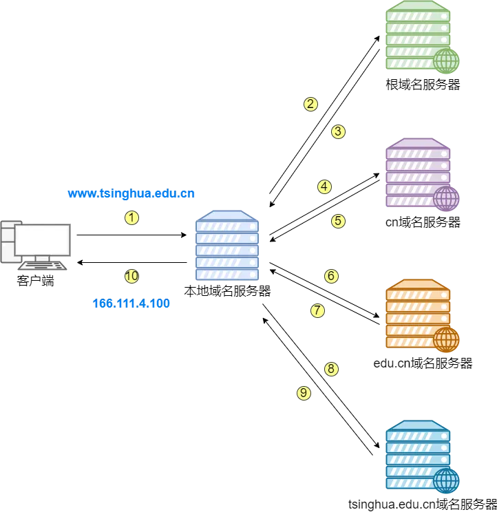

### 1、HTTPS 中 SSL 协议的握手过程

握手阶段分成五步，假定客户端叫做爱丽丝，服务器叫做鲍勃：

第一步，爱丽丝给出协议版本号、一个客户端生成的随机数（Client random），以及客户端支持的加密方法。

第二步，鲍勃确认双方使用的加密方法，并给出数字证书、以及一个服务器生成的随机数（Server random）。

第三步，爱丽丝确认数字证书有效，然后生成一个新的随机数（Premaster secret），并使用数字证书中的公钥，加密这个随机数，发给鲍勃。

第四步，鲍勃使用自己的私钥，获取爱丽丝发来的随机数（即 Premaster secret）。

第五步，爱丽丝和鲍勃根据约定的加密方法，使用前面的三个随机数，生成"对话密钥"（session key），用来加密接下来的整个对话过程。

上面的五步，画成一张图，就是下面这样。

相关文章：
[图解 SSL/TLS 协议](http://www.ruanyifeng.com/blog/2014/09/illustration-ssl.html)

### 2、HTTP2 有没有了解过？相对于 HTTP1.1 有哪些改进

- **多路复用** 即连接共享，每一个 request 都是是用作连接共享机制的。一个 request 对应一个 id，这样一个连接上可以有多个 request，每个连接的 request 可以随机的混杂在一起，接收方可以根据 request 的 id 将 request 再归属到各自不同的服务端请求里面。

- **二进制分帧** 是 **多路复用** 的基础，HTTP1.x 的解析是基于文本。基于文本协议的格式解析存在天然缺陷，文本的表现形式有多样性，要做到健壮性考虑的场景必然很多，二进制则不同，只认 0 和 1 的组合。基于这种考虑 HTTP2.0 的协议解析决定采用二进制格式，实现方便且健壮。

- **header 压缩**，如上文中所言，对前面提到过 HTTP1.x 的 header 带有大量信息，而且每次都要重复发送，HTTP2.0 在服务器和客户端之间建立哈希表，将用到的字段存放在这张表中，那么在传输的时候对于之前出现过的值，只需要把索引(比如 0，1，2，...)传给对方即可，对方拿到索引查表就行了。这种传索引的方式，让请求头字段得到极大程度的精简和复用。

- **服务端推送** 在 HTTP/2 当中，服务器已经不再是完全被动地接收请求，响应请求，它也能新建 stream 来给客户端发送消息，当 TCP 连接建立之后，比如浏览器请求一个 HTML 文件，服务器就可以在返回 HTML 的基础上，将 HTML 中引用到的其他资源文件一起返回给客户端，减少客户端的等待。

相关链接：

- [HTTP 灵魂之问，巩固你的 HTTP 知识体系](https://juejin.cn/post/6844904100035821575)
- [HTTP1.1 和 HTTP2.0 的区别](https://juejin.im/entry/6844903489596833800)

### 3、HTTP3 有没有了解过？

http2 解决了 http1.1 的队头阻塞问题，但是没有解决 tcp 层面的队头阻塞问题。

此外 tcp 本身还存在慢启动、拥塞控制等问题。http3 基于 UDP 协议，使用 QUIC 协议，解决了 tcp 协议的这些问题。

相关链接：
[wiki http3](https://zh.wikipedia.org/wiki/HTTP/3)

### 4、DNS 的解析过程

<!-- TODO: wanger 要修改 -->

DNS 客户端进行域名 <http://www.tsinghua.edu.cn> 的解析过程如下：

1、**DNS 客户端** 向本地域名服务器发送请求，查询 <http://www.tsinghua.edu.cn> 主机的 IP 地址；
2、**本地域名服务器**查询数据库，发现没有域名为 <http://www.tsinghua.edu.cn> 的主机，于是将请求发送给根域名服务器；
3、**根域名服务器**查询数据库，发现没有这个主机域名记录，但是根域名服务器知道 cn 域名服务器可以解析这个域名，于是将 cn 域名服务器的 IP 地址返回给本地域名服务器；
4、**本地域名服务器**向 cn 域名服务器查询 <http://www.tsinghua.edu.cn> 主机的 IP 地址；
5、**cn 域名服务器**查询数据库，也没有相关记录，但是知道 <http://edu.cn> 域名服务器可以解析这个域名，于是将 <http://edu.cn> 域名服务器的 IP 地址返回给本地域名服务器；
6、**本地域名服务器**再向 <http://edu.cn> 域名服务器查询 <http://www.tsinghua.edu.cn> 主机 IP 地址；
7、**<http://edu.cn> 域名服务器**查询数据库，也没有相关记录，但是知道 <http://tsinghua.edu.cn> 域名服务器可以解析这个域名，于是将 <http://tsinghua.edu.cn> 的域名服务器 IP 地址返回给本地域名服务器；
8、**本地域名服务器**向 <http://tsinghua.edu.cn> 域名服务器查询 <http://www.tsinghua.edu.cn> 主机的 IP 地址；
9、**<http://tsinghua.edu.cn> 域名服务器**查询数据库，发现有主机域名记录，于是给本地域名服务器返回 <http://www.tsinghua.edu.cn> 对应的 IP 地址；
10、最后**本地域名服务器**将 <http://www.tsinghua.edu.cn> 的 IP 地址返回给客户端，整个解析过程完成。

上面过程中，计算机向本地域名服务器请求的过程是**递归查询**，而本地域名服务器发起的一系列请求是**迭代查询**。

参考链接:

- [知乎: DNS 解析的过程是什么](https://www.zhihu.com/question/23042131/answer/2051992590)
- [youtube: DNS 服务器（域名系统）的工作方式](https://www.youtube.com/watch?v=mpQZVYPuDGU&ab_channel=PowerCertAnimatedVideos)

### 5、DNS 使用的是 UDP 协议么？

在绝大多数情况下，DNS 都是使用 UDP 协议进行通信的，DNS 协议在设计之初也推荐我们在进行域名解析时首先使用 UDP，这确实能解决很多需求，但是不能解决全部的问题。

实际上，DNS 不仅使用了 UDP 协议，也使用了 TCP 协议，因为 DNS 查询的类型不止包含 A 记录、CNAME 记录等常见查询，还包含 AXFR 类型的特殊查询，这种特殊查询主要用于 DNS 区域传输，它的作用就是在多个命名服务器之间快速迁移记录，由于查询返回的响应比较大，所以会使用 TCP 协议来传输数据包。

总结来说：**UDP 用于 client 和 server 的查询和响应，TCP 用于主从 server 之间的数据传输**

参考链接:

- [为什么 DNS 使用 UDP 协议](https://draveness.me/whys-the-design-dns-udp-tcp/)
- [知乎: DNS 解析的过程是什么](https://www.zhihu.com/question/23042131/answer/2051992590)

### 6、TCP/UDP 的区别，以及各自的应用场景

- TCP 需要建立连接，UDP 发送数据前不需要建连接
- TCP 提供可靠的服务（数据传输），UDP 无法保证
- TCP 面向字节流，UDP 面向报文
- TCP 数据传输慢，UDP 数据传输快
- UDP 的首部开销小，只有 8 个字节。TCP 至少需要 20 个字节
- UDP 支持一对一、一对多、多对一和多对多的交互通信。而 TCP 只支持一对一的通信

### 7、TCP 和 UDP 分别对应的常见应用层协议

#### TCP 对应的应用层协议

- FTP: 文件传输协议
- Telnet: 远程登陆命令
- SMTP: 简单邮件传送协议
- POP3: 邮局协议
- HTTP: 输超文本传输协议
- WebSocket

#### UDP 对应的应用层协议

- DNS：用于域名解析服务

### 8、ARP 协议是什么

ARP（Address Resolution Protocol）即地址解析协议，**解决了从 目标 IP 地址到 目标 MAC 地址的映射问题**。

更进一步解释：

- 当客户端与同一网络中的主机通信时，它将提供该主机的 MAC 地址
- 当客户端与不同网络中的主机通信时，它将提供默认网关的 MAC 地址

相关阅读：

[Key Players](https://www.practicalnetworking.net/series/packet-traveling/key-players/)

### 9、IP 有哪些私有网段

有 A、B、C 三个网段地址范围：

10.0.0.0/8:10.0.0.0-10.255.255.255
172.16.0.0/12:172.16.0.0-172.31.255.255
192.168.0.0/16:192.168.0.0-192.168.255.255

### 10、DDOS 攻击有没有了解过，原理是什么?

客户端向服务端发送请求链接数据包,服务端向客户端发送确认数据包,但是客户端不向服务端发送确认数据包，导致服务器一直等待来自客户端的确认，占用大量资源
