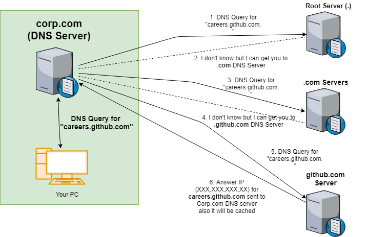

### 1、HTTPS 中 SSL 协议的握手过程

握手阶段分成五步，假定客户端叫做爱丽丝，服务器叫做鲍勃：

第一步，爱丽丝给出协议版本号、一个客户端生成的随机数（Client random），以及客户端支持的加密方法。

第二步，鲍勃确认双方使用的加密方法，并给出数字证书、以及一个服务器生成的随机数（Server random）。

第三步，爱丽丝确认数字证书有效，然后生成一个新的随机数（Premaster secret），并使用数字证书中的公钥，加密这个随机数，发给鲍勃。

第四步，鲍勃使用自己的私钥，获取爱丽丝发来的随机数（即Premaster secret）。

第五步，爱丽丝和鲍勃根据约定的加密方法，使用前面的三个随机数，生成"对话密钥"（session key），用来加密接下来的整个对话过程。

上面的五步，画成一张图，就是下面这样。

相关文章：
[图解SSL/TLS协议](http://www.ruanyifeng.com/blog/2014/09/illustration-ssl.html)

### 2、HTTP2 有没有了解过？相对于 HTTP1.1 有哪些改进

- **二进制分帧**（Binary Format），HTTP1.x的解析是基于文本。基于文本协议的格式解析存在天然缺陷，文本的表现形式有多样性，要做到健壮性考虑的场景必然很多，二进制则不同，只认0和1的组合。基于这种考虑HTTP2.0的协议解析决定采用二进制格式，实现方便且健壮。

- **多路复用**（MultiPlexing），即连接共享，即每一个request都是是用作连接共享机制的。一个request对应一个id，这样一个连接上可以有多个request，每个连接的request可以随机的混杂在一起，接收方可以根据request的 id将request再归属到各自不同的服务端请求里面。

- **header压缩**，如上文中所言，对前面提到过HTTP1.x的header带有大量信息，而且每次都要重复发送，HTTP2.0使用encoder来减少需要传输的header大小，通讯双方各自cache一份header fields表，既避免了重复header的传输，又减小了需要传输的大小。

- **服务端推送**（server push），同SPDY一样，HTTP2.0也具有server push功能。

相关链接：
[HTTP1.1 和 HTTP2.0 的区别](https://juejin.im/entry/6844903489596833800)

### 3、HTTP3 有没有了解过？

在HTTP/3中，将弃用TCP协议，改为使用基于UDP协议的QUIC协议实现。QUIC（快速UDP网络连接）是一种实验性的网络传输协议，由Google开发，该协议旨在使网页传输更快。

相关链接：
[wiki http3](https://zh.wikipedia.org/wiki/HTTP/3)

### 4、DNS 的解析过程

### 5、TCP/UDP 的区别，以及各自的应用场景

- TCP需要建立连接，UDP发送数据前不需要建连接
- TCP提供可靠的服务（数据传输），UDP无法保证
- TCP面向字节流，UDP面向报文
- TCP数据传输慢，UDP数据传输快
- UDP 的首部开销小，只有 8 个字节。TCP 至少需要20个字节
- UDP 支持一对一、一对多、多对一和多对多的交互通信。而 TCP 只支持一对一的通信

### 6、TCP 和 UDP 分别对应的常见应用层协议

#### TCP对应的应用层协议

- FTP: 文件传输协议
- Telnet: 远程登陆命令
- SMTP: 简单邮件传送协议
- POP3: 邮局协议
- HTTP: 输超文本传输协议
- WebSocket

#### UDP对应的应用层协议

- DNS：用于域名解析服务

### 7、ARP协议是什么

ARP（Address Resolution Protocol）即地址解析协议， 解决了从 目标 IP 地址到 目标 MAC 地址的映射问题

### 8、IP 有哪些私有网段

有 A、B、C 三个网段地址范围：

10.0.0.0/8:10.0.0.0-10.255.255.255
172.16.0.0/12:172.16.0.0-172.31.255.255
192.168.0.0/16:192.168.0.0-192.168.255.255

### 9、DDOS 攻击有没有了解过，原理是什么?

客户端向服务端发送请求链接数据包,服务端向客户端发送确认数据包,但是客户端不向服务端发送确认数据包，导致服务器一直等待来自客户端的确认，占用大量资源
