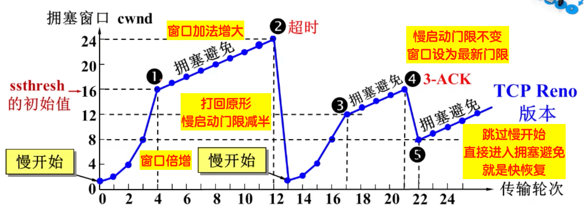

### 1、如何防止 JS 读取 cookie 值？

在相应头加上 `HttpOnly`，例如：

```http
Set-Cookie: <cookie名>=<cookie值>; HttpOnly
```

### 2、`Set-Cookie` 字段还可以有哪些属性？

有 `Expires`、`Max-Age`、`Domain`、`Secure`、`HttpOnly`：

```http
Set-Cookie: <cookie-name>=<cookie-value>; Expires=<date>
Set-Cookie: <cookie-name>=<cookie-value>; Max-Age=<non-zero-digit>
Set-Cookie: <cookie-name>=<cookie-value>; Domain=<domain-value>
Set-Cookie: <cookie-name>=<cookie-value>; Path=<path-value>
Set-Cookie: <cookie-name>=<cookie-value>; Secure
Set-Cookie: <cookie-name>=<cookie-value>; HttpOnly
Set-Cookie: <cookie-name>=<cookie-value>; SameSite=<Lax | Strict>;
```

- `Expires` 属性指定一个具体的到期时间，到了指定时间以后，浏览器就不再保留这个 Cookie。
- `Max-Age` 属性指定从现在开始 Cookie 存在的秒数。过了这个时间以后，浏览器就不再保留这个 Cookie。
- `Domain` 属性指定浏览器发出 HTTP 请求时，哪些域名要附带这个 Cookie。如果没有指定该属性，浏览器会默认将其设为当前 URL 的一级域名。
- `Path` 属性指定浏览器发出 HTTP 请求时，哪些路径要附带这个 Cookie。
- `Secure` 属性指定浏览器只有在加密协议 HTTPS 下，才能将这个 Cookie 发送到服务器。
- `HttpOnly` 属性指定该 Cookie 无法通过 JavaScript 脚本拿到。
- `SameSite` 属性用来限制第三方 Cookie，从而减少安全风险（例如：减少 csrf 攻击）。

[Javascript 标准参考教程：Cookie](https://javascript.ruanyifeng.com/bom/cookie.html)

### 3、TCP 三次握手


第一次：客户端发送连接请求报文给服务端，其中 SYN=1，seq=x。发送完毕后进入 SYN-SENT 状态。

第二次：服务端接收到报文后，发回确认报文，其中 ACK=1，ack=x+1，因为需要客户端确认，所以报文中也有 SYN=1，seq=y 的信息。发送完后进入 SYN-RCVD 状态。

第三次:客户端接收到报文后,发送确认报文，其中 ACK=1，ack=y+1。发送完客户端进入 ESTABLISHED 状态，服务端接收到报文后，进入 ESTABLISHED 状态。到此，连接建立完成。

相关链接：
[UDP 和 TCP 协议](https://github.com/Android-XXM/XXM-BLOG/issues/16)

### 4、TCP 为什么需要三次握手？两次握手不行吗？

为了防止 **已失效的链接请求报文突然又传送到了服务端**，因而产生错误。

假设有这样一种场景，客户端发送了第一个请求连接并且没有丢失，而是在网络结点中滞留的时间太长了，由于 TCP 的客户端迟迟没有收到确认报文，以为服务器没有收到，此时重新向服务器发送这条报文，此后客户端和服务器经过两次握手完成连接，传输数据，然后关闭连接。此时此前滞留的那一次请求连接，网络通畅了到达了服务器，这个报文本该是失效的，但是，两次握手的机制将会让客户端和服务器再次建立连接，这将导致不必要的错误和资源的浪费。

如果采用的是三次握手，就算是那一次失效的报文传送过来了，服务端接受到了那条失效报文并且回复了确认报文，但是客户端不会再次发出确认。由于服务器收不到确认，就知道客户端并没有请求连接。

### 5、TCP 四次挥手


第一次挥手：客户端发送 FIN=1，seq=x 的包给服务端，表示自己没有数据要进行传输，单面连接传输要关闭。发送完后，客户端进入 FIN_WAIT_1 状态。

第二次挥手：服务端收到请求包后，发回 ACK=1,ack=x+1 的确认包，表示确认断开连接。服务端进入 CLOSE_WAIT 状态。客户端收到该包后，进入 FIN_WAIT_2 状态。此时客户端到服务端的数据连接已断开。

第三次挥手：服务端发送 FIN=1,seq=y 的包给客户端，表示自己没有数据要给客户端了。发送完后进入 LAST_ACK 状态，等待客户端的确认包。

第四次挥手：客户端收到请求包后，发送 ACK=1,ack=y+1 的确认包给服务端，并进入 TIME_WAIT 状态，有可能要重传确认包。服务端收到确认包后，进入 CLOSED 状态，服务端到客户端的连接已断开。客户端等到一段时间后也会进入 CLOSED 状态。

相关链接：
[UDP 和 TCP 协议](https://github.com/Android-XXM/XXM-BLOG/issues/16)

### 6、为什么建立连接是三次握手，关闭连接确是四次挥手呢？

建立连接的时候，服务器在 LISTEN 状态下，收到建立连接请求的 SYN 报文后，把 ACK 和 SYN 放在一个报文里发送给客户端。

而关闭连接时，服务器收到对方的 FIN 报文时，仅仅表示对方不再发送数据了但是还能接收数据，而自己也未必全部数据都发送给对方了，所以己方可以立即关闭，也可以发送一些数据给对方后，再发送 FIN 报文给对方来表示同意现在关闭连接，因此，己方 ACK 和 FIN 一般都会分开发送，从而导致多了一次。

### 7、TCP 如何保证可靠传输？

- 数据包校验
- 超时重传机制
- 对失序数据包重排序
- TCP 供流量控制
- TCP 供拥塞控制

### 8、为什么 TCP 协议有 TIME_WAIT 状态？

当客户端发出最后的 ACK 确认报文时，并不能确定服务器端能够收到该段报文。所以客户端在发送完 ACK 确认报文之后，会设置一个时长为 2 MSL 的计时器。MSL（Maximum Segment Lifetime），指一段 TCP 报文在传输过程中的最大生命周期。2 MSL 即是服务器端发出 FIN 报文和客户端发出的 ACK 确认报文所能保持有效的最大时长。

若服务器在 1 MSL 内没有收到客户端发出的 ACK 确认报文，再次向客户端发出 FIN 报文。如果客户端在 2 MSL 内收到了服务器再次发来的 FIN 报文，说明服务器由于一些原因并没有收到客户端发出的 ACK 确认报文。客户端将再次向服务器发出 ACK 确认报文，并重新开始 2 MSL 的计时。

若客户端在 2MSL 内没有再次收到服务器发送的 FIN 报文，则说明服务器正常接收到客户端 ACK 确认报文，客户端可以进入 CLOSE 阶段，即完成四次挥手。

所以客户端要经历 2 MSL 时长的 TIME-WAIT 阶段，为的是确认服务器能否接收到客户端发出的 ACK 确认报文。

这样就能避免延迟的数据段被其他使用相同源地址、源端口、目的地址以及目的端口的 TCP 连接收到；

参考链接：

- [LeetCode](https://leetcode.cn/leetbook/read/networks-interview-highlights/esno32/)
- [为什么 TCP 协议有 TIME_WAIT 状态](https://draveness.me/whys-the-design-tcp-time-wait/)

### 9、TCP 流量控制与拥塞控制细节

#### 流量控制

所谓流量控制就是让发送方的发送速率不要太快，让接收方来得及接收。如果接收方来不及接收发送方发送的数据，那么就会有分组丢失。在 TCP 中利用可变长的滑动窗口机制可以很方便的在 TCP 连接上实现对发送方的流量控制。主要的方式是接收方返回的 ACK 中会包含自己的接收窗口大小，以控制发送方此次发送的数据量大小（发送窗口大小）。

#### 拥塞控制

在实际的网络通信系统中，除了发送方和接收方外，还有路由器，交换机等复杂的网络传输线路，此时就需要拥塞控制。拥塞控制是作用于网络的，它是防止过多的数据注入到网络中，避免出现网络负载过大的情况。常用的解决方法有：慢开始和拥塞避免、快重传和快恢复。



#### 拥塞控制和流量控制的区别

拥塞控制往往是一种全局的，防止过多的数据注入到网络之中，而 TCP 连接的端点只要不能收到对方的确认信息，猜想在网络中发生了拥塞，但并不知道发生在何处，因此，流量控制往往指点对点通信量的控制，是端到端的问题。

参考链接：

- [LeetCode](https://leetcode.cn/leetbook/read/networks-interview-highlights/estnmd/)
