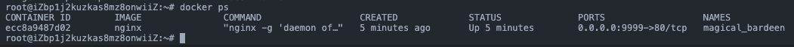
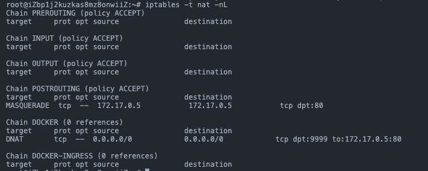

### 1、`docker save` 与 `docker export` 的区别？

- `docker save` 保存的是镜像，`docker export`保存的是容器；

### 2、`docker load` 与 `docker import` 的区别？

- `docker load` 用来载入镜像包，`docker import` 用来载入容器包，但两者都会恢复为镜像；
- `docker load` 不能对载入的镜像重命名，而 `docker import` 可以为镜像指定新名称。

### 3、Dockerfile 中 COPY 与 ADD 的区别？

ADD 指令和 COPY 的格式和性质基本一致。但是在 COPY 基础上增加了一些功能，它可以自动解压缩文件。

另外需要注意的是，ADD 指令会令镜像构建缓存失效，从而可能会令镜像构建变得比较缓慢。

因此在 COPY 和 ADD 指令中选择的时候，可以遵循这样的原则，所有的文件复制均使用 COPY 指令，仅在需要自动解压缩的场合使用 ADD。

### 4、容器的端口是怎么映射到 host 主机上的？

容器所有到外部网络的连接，源地址都会被 NAT 成本地系统的 IP 地址。这是使用 iptables 的源地址转发实现的。

以 ubuntu16.04 做实验，参考如下：

用 docker 创建一个 nginx 服务：

```bash
docker run -p 9999:80 -d nginx
```

`docker ps`查看，可以看到nginx容器正在运行：



用 iptables 查看当前防火墙，执行：

``` bash
iptables -t nat -nL
```



可以看到 `Chain DOCKER` 中 `172.17.0.5:80` 被转发到了宿主机的 9999 端口

### 5、为什么两个容器可以互相 ping 通？

借助 网桥、VETH 的能力。

Docker 服务默认会创建一个 docker0 网桥，所有容器创建时都会通过veth默认链接到这个网桥上。


### 5、一个 DockerFile 文件长什么样？

```DockerFile
FROM node:alpine

RUN npm install yarn

WORKDIR /app

COPY package.json /app

RUN yarn

COPY src /app/src

EXPOSE 3000

CMD ["node","src/app.js"]
```

### 6、docker-compose.yml 文件长什么样？

```yml
version: '3'
services:
  nginx:
    restart: always
    image: nginx
    ports:
      - "8080:80"
    volumes:
      - ./log:/var/log/nginx
      - ./html:/usr/share/nginx/html
      - ./conf.d:/etc/nginx/conf.d
```
