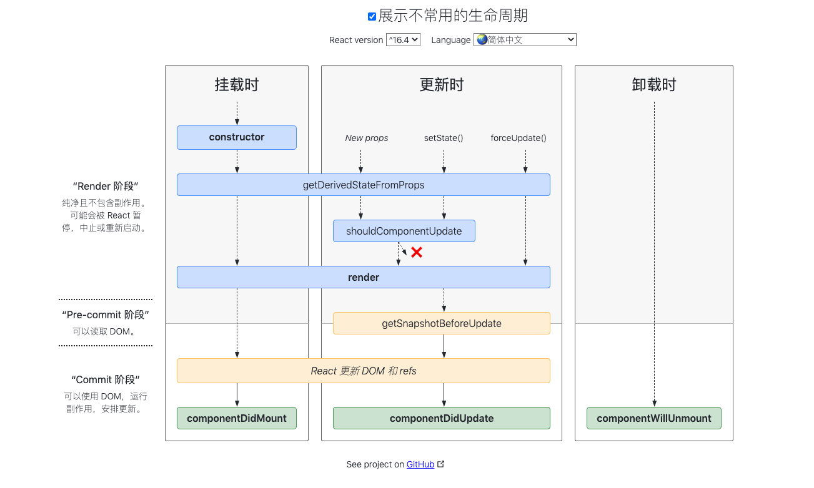
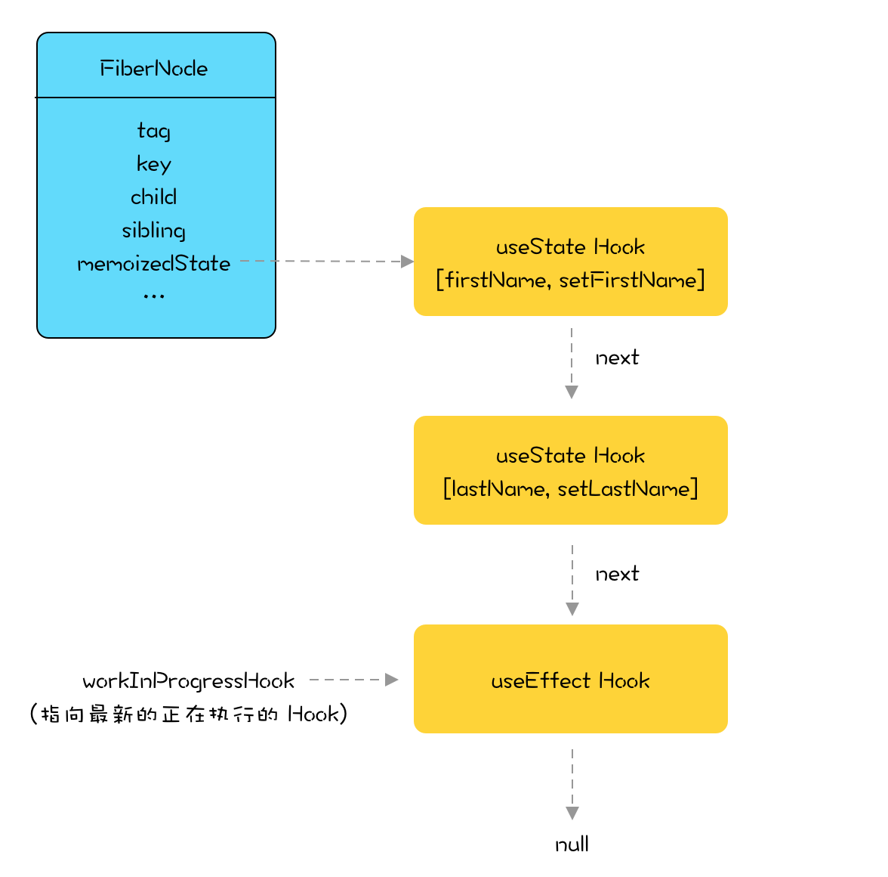
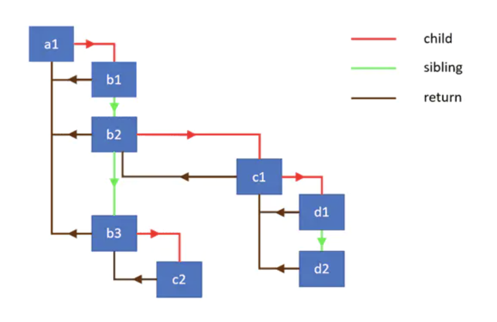
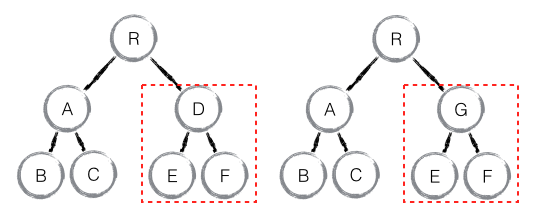

### 1、setState 是异步还是同步？

1. 合成事件中是异步
1. 钩子函数中的是异步
1. 原生事件中是同步
1. setTimeout中是同步

相关链接：
[你真的理解setState吗？](https://juejin.im/post/6844903636749778958)

### 2、聊聊 react@16.4 + 的生命周期

相关连接：
[React 生命周期](https://projects.wojtekmaj.pl/react-lifecycle-methods-diagram/)
[我对 React v16.4 生命周期的理解](https://juejin.im/post/6844903655372488712)

### 3、useEffect(fn, []) 和 componentDidMount 有什么差异？

`useEffect` 会捕获 `props` 和 `state`。所以即便在回调函数里，你拿到的还是初始的 `props` 和 `state`。如果想得到“最新”的值，可以使用 `ref`。

### 4、hooks 为什么不能放在条件判断里？

以 `setState` 为例，在 react 内部，每个组件(Fiber)的 hooks 都是以链表的形式存在 `memoizeState` 属性中：

update 阶段，每次调用 `setState`，链表就会执行 next 向后移动一步。如果将 `setState` 写在条件判断中，假设条件判断不成立，没有执行里面的 `setState` 方法，会导致接下来所有的 `setState` 的取值出现偏移，从而导致异常发生。

参考链接：
[烤透 React Hook](https://juejin.im/post/6867745889184972814)

### 5、fiber 是什么？

**React Fiber 是一种基于浏览器的单线程调度算法。**

React Fiber 用类似 `requestIdleCallback` 的机制来做异步 diff。但是之前数据结构不支持这样的实现异步 diff，于是 React 实现了一个类似链表的数据结构，将原来的 递归diff 变成了现在的 遍历diff，这样就能做到异步可更新了。

相关链接：
[React Fiber 是什么？](https://github.com/WangYuLue/react-in-deep/blob/main/02.React%20Fiber%20%E6%98%AF%E4%BB%80%E4%B9%88%EF%BC%9F.md)

### 6、聊一聊 diff 算法

传统 diff 算法的时间复杂度是 O(n^3)，这在前端 render 中是不可接受的。为了降低时间复杂度，react 的 diff 算法做了一些妥协，放弃了最优解，最终将时间复杂度降低到了 O(n)。

那么 react diff 算法做了哪些妥协呢？，参考如下：

1、tree diff：只对比同一层的 dom 节点，忽略 dom 节点的跨层级移动

如下图，react 只会对相同颜色方框内的 DOM 节点进行比较，即同一个父节点下的所有子节点。当发现节点不存在时，则该节点及其子节点会被完全删除掉，不会用于进一步的比较。

这样只需要对树进行一次遍历，便能完成整个 DOM 树的比较。

这就意味着，如果 dom 节点发生了跨层级移动，react 会删除旧的节点，生成新的节点，而不会复用。

2、component diff：如果不是同一类型的组件，会删除旧的组件，创建新的组件

3、element diff：对于同一层级的一组子节点，需要通过唯一 id 进行来区分

如果没有 id 来进行区分，一旦有插入动作，会导致插入位置之后的列表全部重新渲染。

这也是为什么渲染列表时为什么要使用唯一的 key。
