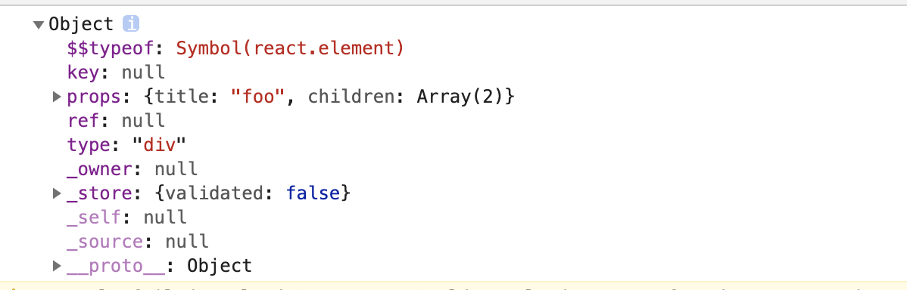

### 1、React 组件间有那些通信方式?

#### 父组件向子组件通信

1、 通过 props 传递

#### 子组件向父组件通信

1、 主动调用通过 props 传过来的方法，并将想要传递的信息，作为参数，传递到父组件的作用域中

#### 跨层级通信

1、 使用 react 自带的 `Context` 进行通信，`createContext` 创建上下文， `useContext` 使用上下文。

参考下面代码：

```tsx
import React, { createContext, useContext } from "react";

const themes = {
  light: {
    foreground: "#000000",
    background: "#eeeeee",
  },
  dark: {
    foreground: "#ffffff",
    background: "#222222",
  },
};

const ThemeContext = createContext(themes.light);

function App() {
  return (
    <ThemeContext.Provider value={themes.dark}>
      <Toolbar />
    </ThemeContext.Provider>
  );
}

function Toolbar() {
  return (
    <div>
      <ThemedButton />
    </div>
  );
}

function ThemedButton() {
  const theme = useContext(ThemeContext);
  return (
    <button style={{ background: theme.background, color: theme.foreground }}>
      I am styled by theme context!
    </button>
  );
}

export default App;
```

2、使用 Redux 或者 Mobx 等状态管理库

3、使用订阅发布模式

相关链接：
[React Docs](https://zh-hans.reactjs.org/docs/hooks-reference.html#usecontext)

### 2、React 父组件如何调用子组件中的方法？

1、如果是在方法组件中调用子组件（`>= react@16.8`），可以使用 `useRef` 和 `useImperativeHandle`:

```tsx
const { forwardRef, useRef, useImperativeHandle } = React;

const Child = forwardRef((props, ref) => {
  useImperativeHandle(ref, () => ({
    getAlert() {
      alert("getAlert from Child");
    },
  }));
  return <h1>Hi</h1>;
});

const Parent = () => {
  const childRef = useRef();
  return (
    <div>
      <Child ref={childRef} />
      <button onClick={() => childRef.current.getAlert()}>Click</button>
    </div>
  );
};
```

2、如果是在类组件中调用子组件（`>= react@16.4`），可以使用 `createRef`:

```tsx
const { Component } = React;

class Parent extends Component {
  constructor(props) {
    super(props);
    this.child = React.createRef();
  }

  onClick = () => {
    this.child.current.getAlert();
  };

  render() {
    return (
      <div>
        <Child ref={this.child} />
        <button onClick={this.onClick}>Click</button>
      </div>
    );
  }
}

class Child extends Component {
  getAlert() {
    alert("getAlert from Child");
  }

  render() {
    return <h1>Hello</h1>;
  }
}
```

3、如果是别的函数想要调用子组件方法，可以在子组件中暴露本身给外部

```tsx
const emitChildFn = () => {
  const onRef = (ref) => {
    ref.getAlert();
  };

  const element = <Child onRef={onRef} />;

  const wrapper = document.createElement("div");
  ReactDOM.render(element, wrapper);
};

class Child extends Component {
  componentDidMount() {
    this.props.onRef?.(this);
  }
  getAlert() {
    alert("getAlert from Child");
  }

  render() {
    return <h1>Hello</h1>;
  }
}
```

参考阅读：
[Call child method from parent](https://stackoverflow.com/questions/37949981/call-child-method-from-parent)

[React 父组件调用子组件方法](https://segmentfault.com/a/1190000021920132)

### 3、React 有哪些优化性能的手段?

#### 类组件中的优化手段

1、使用纯组件 `PureComponent` 作为基类。

2、使用 `React.memo` 高阶函数包装组件。

3、使用 `shouldComponentUpdate` 生命周期函数来自定义渲染逻辑。

#### 方法组件中的优化手段

1、使用 `useMemo`。

2、使用 `useCallBack`。

#### 其他方式

1、在列表需要频繁变动时，使用唯一 id 作为 key，而不是数组下标。

2、必要时通过改变 CSS 样式隐藏显示组件，而不是通过条件判断显示隐藏组件。

3、使用 `Suspense` 和 `lazy` 进行懒加载，例如：

```tsx
import React, { lazy, Suspense } from "react";

export default class CallingLazyComponents extends React.Component {
  render() {
    var ComponentToLazyLoad = null;

    if (this.props.name == "Mayank") {
      ComponentToLazyLoad = lazy(() => import("./mayankComponent"));
    } else if (this.props.name == "Anshul") {
      ComponentToLazyLoad = lazy(() => import("./anshulComponent"));
    }

    return (
      <div>
        <h1>This is the Base User: {this.state.name}</h1>
        <Suspense fallback={<div>Loading...</div>}>
          <ComponentToLazyLoad />
        </Suspense>
      </div>
    );
  }
}
```

`Suspense` 用法可以参考[官方文档](https://zh-hans.reactjs.org/docs/concurrent-mode-suspense.html)

相关阅读：
[21 个 React 性能优化技巧](https://www.infoq.cn/article/KVE8xtRs-uPphptq5LUz)

### 4、为什么 React 元素有一个 $$typeof 属性？



目的是为了防止 XSS 攻击。因为 Synbol 无法被序列化，所以 React 可以通过有没有 $$typeof 属性来断出当前的 element 对象是从数据库来的还是自己生成的。

如果没有 $$typeof 这个属性，react 会拒绝处理该元素。

在 React 的古老版本中，下面的写法会出现 XSS 攻击：

```tsx
// 服务端允许用户存储 JSON
let expectedTextButGotJSON = {
  type: "div",
  props: {
    dangerouslySetInnerHTML: {
      __html: "/* 把你想的搁着 */",
    },
  },
  // ...
};
let message = { text: expectedTextButGotJSON };

// React 0.13 中有风险
<p>{message.text}</p>;
```

相关阅读：
[Dan Abramov Blog](https://overreacted.io/zh-hans/why-do-react-elements-have-typeof-property/)

### 5、React 如何区分 Class 组件 和 Function 组件？

一般的方式是借助 typeof 和 Function.prototype.toString 来判断当前是不是 class，如下：

```ts
function isClass(func) {
  return (
    typeof func === "function" &&
    /^class\s/.test(Function.prototype.toString.call(func))
  );
}
```

但是这个方式有它的局限性，因为如果用了 babel 等转换工具，将 class 写法全部转为 function 写法，上面的判断就会失效。

React 区分 Class 组件 和 Function 组件的方式很巧妙，由于所有的类组件都要继承 React.Component，所以只要判断原型链上是否有 React.Component 就可以了：

```ts
AComponent.prototype instanceof React.Component;
```

相关阅读：
[Dan Abramov Blog](https://overreacted.io/zh-hans/how-does-react-tell-a-class-from-a-function/)

### 6、HTML 和 React 事件处理有什么区别?

在 HTML 中事件名必须小写：

```html
<button onclick="activateLasers()"></button>
```

而在 React 中需要遵循驼峰写法：

```tsx
<button onClick={activateLasers}>
```

在 HTML 中可以返回 false 以阻止默认的行为：

```html
<a href="#" onclick='console.log("The link was clicked."); return false;' />
```

而在 React 中必须地明确地调用 `preventDefault()`：

```ts
function handleClick(event) {
  event.preventDefault();
  console.log("The link was clicked.");
}
```

### 7、什么是 suspense 组件?

Suspense 让组件“等待”某个异步操作，直到该异步操作结束即可渲染。在下面例子中，两个组件都会等待异步 API 的返回值：

```tsx
const resource = fetchProfileData();

function ProfilePage() {
  return (
    <Suspense fallback={<h1>Loading profile...</h1>}>
      <ProfileDetails />
      <Suspense fallback={<h1>Loading posts...</h1>}>
        <ProfileTimeline />
      </Suspense>
    </Suspense>
  );
}

function ProfileDetails() {
  // 尝试读取用户信息，尽管该数据可能尚未加载
  const user = resource.user.read();
  return <h1>{user.name}</h1>;
}

function ProfileTimeline() {
  // 尝试读取博文信息，尽管该部分数据可能尚未加载
  const posts = resource.posts.read();
  return (
    <ul>
      {posts.map((post) => (
        <li key={post.id}>{post.text}</li>
      ))}
    </ul>
  );
}
```

Suspense 也可以用于懒加载，参考下面的代码：

```tsx
const OtherComponent = React.lazy(() => import("./OtherComponent"));

function MyComponent() {
  return (
    <div>
      <Suspense fallback={<div>Loading...</div>}>
        <OtherComponent />
      </Suspense>
    </div>
  );
}
```

### 8、为什么 JSX 中的组件名要以大写字母开头？

因为 React 要知道当前渲染的是组件还是 HTML 元素。

### 9、手动实现 React Hooks

#### 第一版

```js
let state;

function useState(defaultState) {
  function setState(newState) {
    state = newState;
  }

  if (!state) {
    state = defaultState;
  }
  return [state, setState];
}

function render() {
  const [state, setState] = useState(0);
  console.log(state);
  setState(state + 1);
}

// 下面多次渲染
render();
render();
render();
```

第一版函数中只能设置一个状态，第二版将实现如何设置多个状态。

#### 第二版

第二版中，我们需要多加一个计数器，用于记录函数中多个状态的序列，并且每次执行结束或者执行开始需要把计数器置为 0。

```js
let states = {};
let currentNu = 0;

function useState(defaultState) {
  const nu = currentNu++;

  function setState(newState) {
    states[nu] = newState;
  }

  if (!states[nu]) {
    states[nu] = defaultState;
  }

  return [states[nu], setState];
}

function withState(func) {
  return (...args) => {
    currentNu = 0;
    return func(...args);
  };
}

const render = withState(() => {
  const [state, setState] = useState(0);
  const [state1, setState1] = useState(1);
  const [state2, setState2] = useState(2);

  console.log(state, state1, state2);
  setState(state + 1);
  setState1(state1 + 2);
  setState2(state2 + 3);
});

// 下面多次渲染
render();
render();
render();
```

#### 第三版

一个函数的 hooks 没有问题，但是多个函数的嵌套调用还是会有问题。这时候可以用栈来解决问题。

来看看第三版的实现：

```js
let contextStack = [];

function useState(defaultState) {
  const context = contextStack[contextStack.length - 1];
  const nu = context.nu++;
  const { states } = context;

  function setState(newState) {
    states[nu] = newState;
  }

  if (!states[nu]) {
    states[nu] = defaultState;
  }

  return [states[nu], setState];
}

function withState(func) {
  const states = {};
  return (...args) => {
    contextStack.push({ nu: 0, states });
    const result = func(...args);
    contextStack.pop();
    return result;
  };
}

const sub_render = withState(() => {
  const [state, setState] = useState(0);

  console.log("sub_render", state);
  setState(state + 2);
});

const render = withState(() => {
  const [state, setState] = useState(0);

  sub_render();

  console.log("render", state);
  setState(state + 1);
});

render();
render();
render();
```

参考阅读：

[让我们手动实现 React Hooks](https://zhuanlan.zhihu.com/p/50358654)
