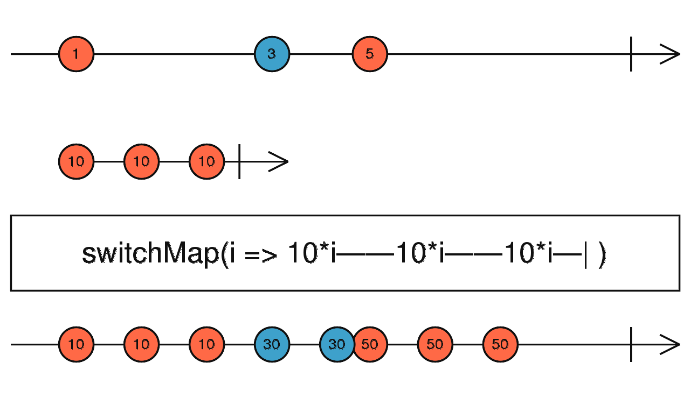
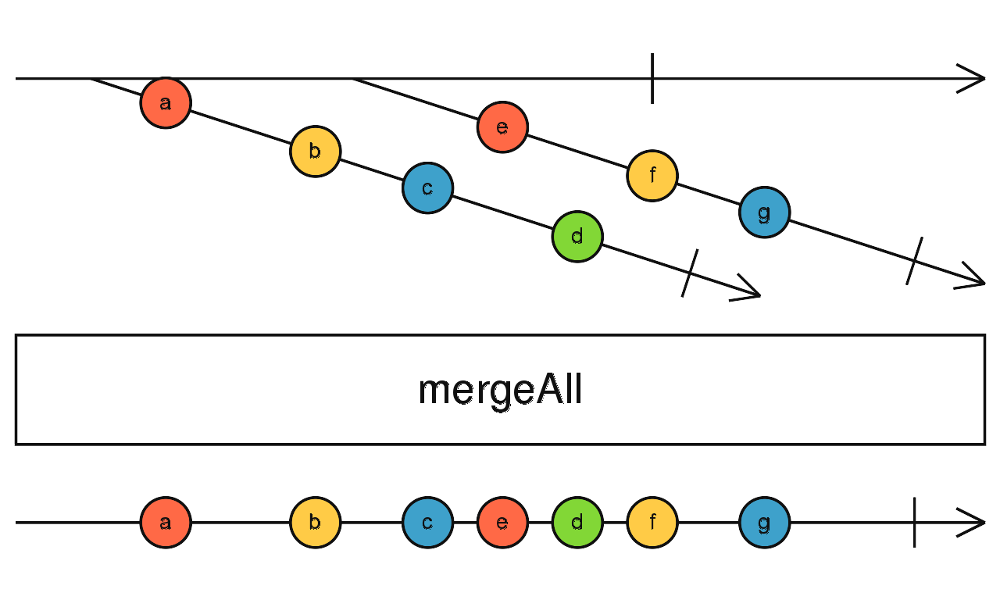

### 1、Rxjs 常用的操作符

#### `combineLatest` 合并流

```ts
import { combineLatest, timer } from "rxjs";

// timerOne emits first value at 1s, then once every 4s
const timerOne$ = timer(1000, 4000);
// timerTwo emits first value at 2s, then once every 4s
const timerTwo$ = timer(2000, 4000);
// timerThree emits first value at 3s, then once every 4s
const timerThree$ = timer(3000, 4000);

const o$ = combineLatest([timerOne$, timerTwo$, timerThree$]);

o$.subscribe((res) => {
  console.log(res);
});
```


#### `debounceTime` 去抖

```ts
import { interval } from "rxjs";
import { debounceTime, take } from "rxjs/operators";

const o$ = interval(200);

// work
o$.pipe(take(5), debounceTime(1000)).subscribe((res) => {
  console.log(res);
});

// not work
o$.pipe(debounceTime(1000), take(5)).subscribe((res) => {
  console.log(res);
});
```

#### `distinctUntilChanged` 改变时才发射

```ts
import { from } from "rxjs";
import { distinctUntilChanged } from "rxjs/operators";

// only output distinct values, based on the last emitted value
const source$ = from([1, 1, 2, 2, 3, 3]);

source$
  .pipe(distinctUntilChanged())
  // output: 1,2,3
  .subscribe(console.log);
```

#### `filter` 过滤

```ts
import { of } from "rxjs";
import { filter } from "rxjs/operators";

const o$ = of(1, 2, 3, 4, 5);

o$.pipe(filter((v) => v % 2 === 0)).subscribe((v) => console.log(v));
```

#### `map` 映射

```ts
import { of } from "rxjs";
import { map } from "rxjs/operators";

const o$ = of(1, 2, 3, 4, 5);

o$.pipe(map((v) => 2 * v)).subscribe((v) => console.log(v));
```

#### `skip` 跳过

```ts
import { interval } from "rxjs";
import { skip } from "rxjs/operators";

const o$ = interval(100);

o$.pipe(skip(3)).subscribe((res) => {
  console.log(res);
});
```

#### `skipUntil` 跳过直到

```ts
import { interval, timer } from "rxjs";
import { skipUntil } from "rxjs/operators";

const o$ = interval(200);

o$.pipe(skipUntil(timer(2000))).subscribe((res) => {
  console.log(res);
});
```

#### `startWith` 开始时发射

```ts
import { timer, map, startWith } from "rxjs";

timer(1000)
  .pipe(
    map(() => "timer emit"),
    startWith("timer start")
  )
  .subscribe((x) => console.log(x));
```

#### `takeUntil` 直到

```ts
import { interval, Subject } from "rxjs";
import { takeUntil } from "rxjs/operators";

const o$ = interval(300);

const destroy$ = new Subject();

setTimeout(() => {
  destroy$.next();
  destroy$.complete();
}, 1000);

o$.pipe(takeUntil(destroy$)).subscribe(console.log);
```

#### `switchMap`

```ts
import { of, interval, switchMap } from "rxjs";

const o$ = interval(500);

o$.pipe(
  switchMap((x) => {
    return of(x, x * 2, x * 3);
  })
).subscribe((v) => console.log(v));
```



#### `mergeAll`

```ts
import { interval, from } from "rxjs";
import { take, mergeAll } from "rxjs/operators";

const $1 = interval(300);

const $2 = interval(450);

from([$1, $2])
  .pipe(mergeAll())
  .pipe(take(5))
  .subscribe((res) => {
    console.log(res);
  });
```



#### `combineLatestAll`

```ts
import { interval, from } from "rxjs";
import { combineLatestAll, take } from "rxjs/operators";

const $1 = interval(300);

const $2 = interval(450);

from([$1, $2])
  .pipe(combineLatestAll())
  .pipe(take(5))
  .subscribe((res) => {
    console.log(res);
  });
```

### 2、一个 Observable 的例子

```ts
import { Observable } from "rxjs";

const observable = new Observable((subscriber) => {
  subscriber.next(1);
  subscriber.next(2);
  subscriber.next(3);
  setTimeout(() => {
    subscriber.next(4);
    subscriber.complete();
  }, 1000);
});

observable.subscribe(console.log);
```

### 3、一个 Subject 的例子

```ts
import { Subject, from } from "rxjs";

const subject = new Subject<number>();

subject.subscribe(console.log);

subject.next(10);
subject.next(20);

setTimeout(() => {
  const observable = from([1, 2, 3]);
  observable.subscribe(subject);
}, 200);
```

### 4、一个 Subscription 的例子

```ts
import { interval, Subscription } from "rxjs";

const sub = new Subscription();

const observable1 = interval(400);
const observable2 = interval(300);

const subscription = observable1.subscribe((x) => console.log("first: " + x));
const childSubscription = observable2.subscribe((x) =>
  console.log("second: " + x)
);

sub.add(subscription);
sub.add(childSubscription);

setTimeout(() => {
  // subscription.unsubscribe();
  // sub.remove(subscription);
  // Unsubscribes BOTH subscription and childSubscription
  console.log(sub.closed);
  sub.unsubscribe();
  console.log(sub.closed);
}, 1000);
```

### 5、rxjs 异步请求问题

场景如下：

发出一个请求，这个请求会返回一个数组；然后再根据这个数组中的每个 item 再发出一个异步请求，返回一个值；最后整理成一个数组返回；

```js
import { of, timer, forkJoin, from } from "rxjs";
import {
  switchMap,
  map,
  mergeAll,
  mergeWith,
  tap,
  combineLatestAll,
} from "rxjs/operators";

const fetch1 = () => {
  return timer(1000).pipe(switchMap(() => of([1, 2, 3, 4])));
};

const fetch2 = (num) => {
  return timer(1000).pipe(switchMap(() => of(num * num)));
};

fetch1()
  .pipe(
    tap(console.log), // 打印查看
    switchMap(from), // 将返回结果作为流发出
    map(fetch2), // 将返回结果中的 item 作为流发出
    // mergeAll(),
    combineLatestAll() // 整合结果
    // mergeWith()
    // forkJoin()
    // switchMap(fetch2)
  )
  .subscribe((res) => {
    console.log(res);
  });
```
